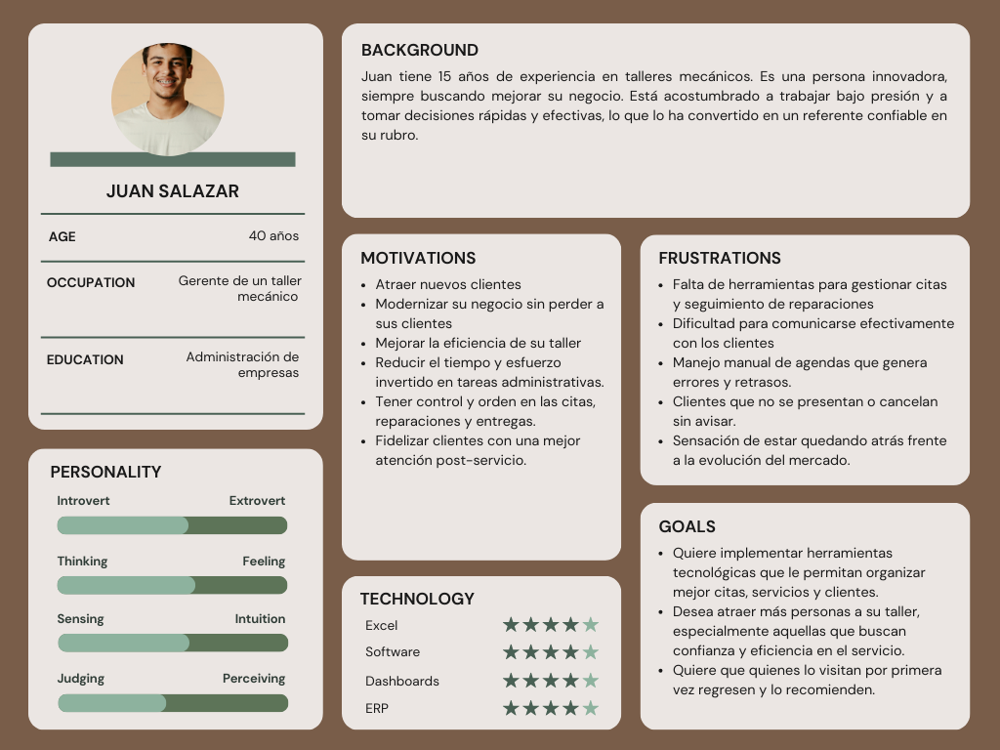
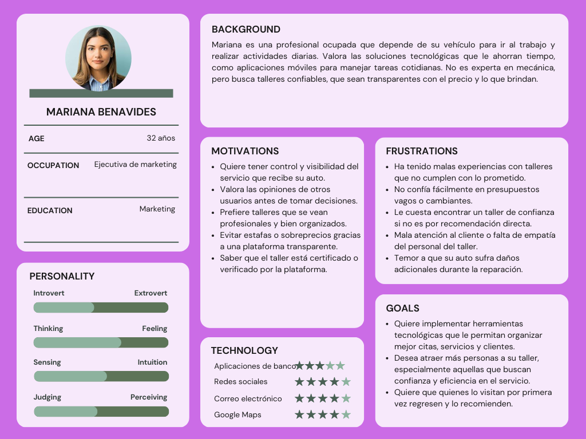
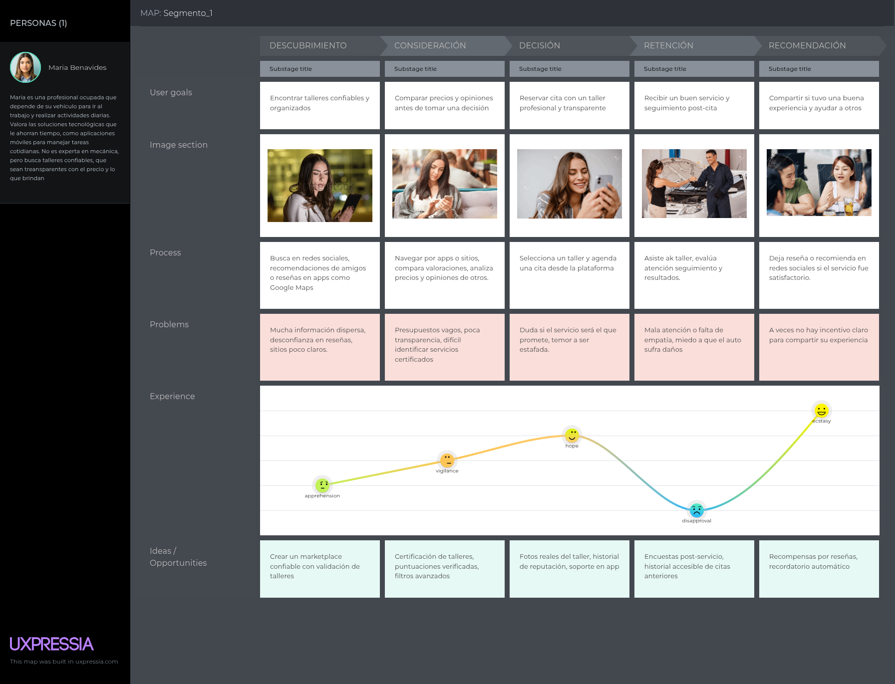
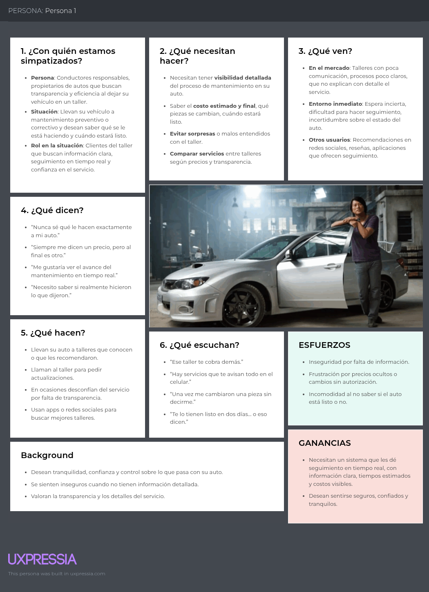
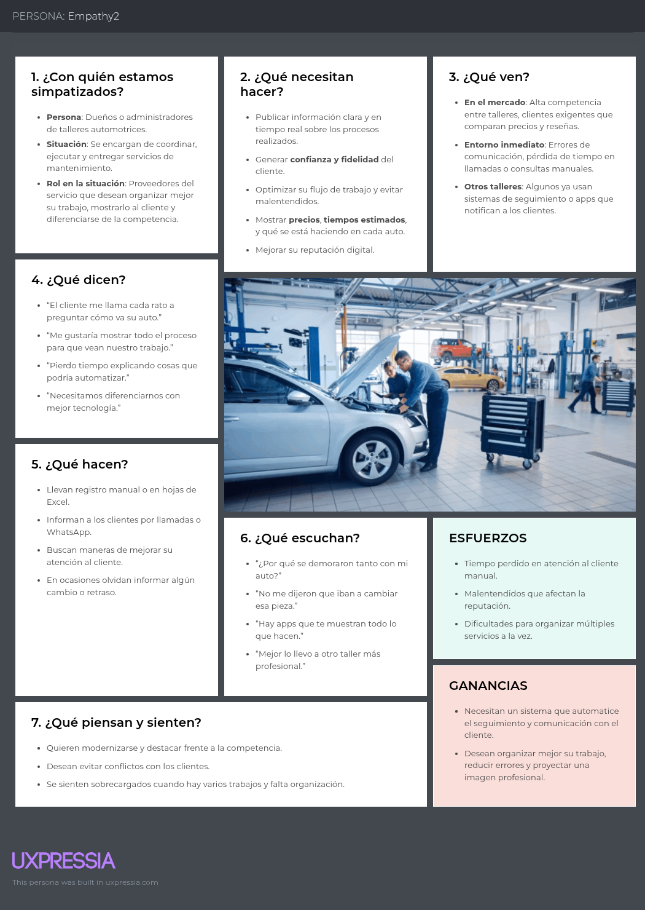

### Capítulo II: Requirements Elicitation & Analysis

#### 2.1. Competidores
App | Overview | Ventaja Competitiva
Tallerazo | Plataforma que conecta a propietarios de vehículos con talleres, permitiendo agendar citas, seguimiento en tiempo real y comunicación directa. | Brinda experiencia digital integral con seguimiento de reparaciones, historial del vehículo y contacto directo.
CarHelp | App que localiza talleres cercanos vía GPS y ofrece asistencia inmediata como grúas. | Ofrece ayuda rápida y localizada, ideal para emergencias en carretera.
Autocontrol.pe | Software ERP para talleres que permite controlar vehículos, inventario y órdenes de trabajo. | Optimiza la operación de talleres con módulos administrativos completos.
Tuulapp | App de gestión de talleres con funciones de citas, clientes y reportes. | Plataforma intuitiva que centraliza operaciones y mejora la eficiencia.

##### 2.1.1. Análisis competitivo

### ¿Por qué tomar en cuenta este análisis?
Con esto, identificamos fortalezas, debilidades y oportunidades frente a los principales competidores para construir un mejor posicionamiento con respecto al mercado.
| **Nombre de los Startups**     |                                              | **Tallerazo** | **Carhelp** | **Autocontrol.pe** | **Tuulapp** |
|-------------------------------|----------------------------------------------|------------------|----------------|----------------------|----------------|
| **Perfil**                    | Overview                                     | Plataforma que conecta a propietarios de vehículos con talleres mecánicos, permitiendo agendar citas, dar seguimiento en tiempo real a reparacionoes y mantener una comunicación directa. | App móvil que permite ubicar talleres automotrices certcanos mediante GPS, además solicitar grúas o asistencia mecánica desde cualquier punto de Lima. | Software ERP escializado para talleres mecánicos que permite gestionar vehículos, órdenes de trabajo, inventarios y emitir alertas automáticas. | App de gestión para talleres que permite controlar operaciones, servicios, citas y seguimiento de vehículos desde una plataforma digital. |
|                               | Ventaja competitiva / ¿Qué valor ofrece?     | Brinda una experiencia transparente y conectada, integrando seguimiento en tiempo real, historial del vehículo y contacto directo con el taller desde una sola app. |Ofrece ayuda rápida y geolocalizada con solo presionar un botón, ideal para emergencias en carretera. | Optimiza la gestión interna del taller con herramientas integrales que facilitan el control administrativo y técnico. | Centraliza la administración del taller y mejora la productividad con una app intuitiva orientada a la eficiencia operativa. |
| **Perfil de Marketing**       | Mercado objetivo                             | Propietarios de vehículos que buscan una experiencia digital, transparente y moderna para el mantenimiento de sus autos, así como talleres interesados en digitalizar su operación. | Promociones en apps móviles, marketing en redes sociales y campañas dirigidas a zonas urbanas con alto tráfico vehicular. | Publicidad en medios especializados, demostraciones del software a talleres, webinars y referidos entre profesionales del sector. | Publicaciones en redes sociales, participación en ferias del sector automotriz, marketing de contenido y videos tutoriales sobre su uso. |
|                               | Estrategias de marketing                     | Publicidad segmentada en redes sociales, alianzas con talleres locales, contenido educativo sobre mantenimiento automotriz y campañas de concientización sobre la importancia del seguimiento digital. | Promociones en apps móviles, marketing en redes sociales y campañas dirigidas a zonas urbanas con alto tráfico vehicular. | Publicidad en medios especializados, demostraciones del software a talleres, webinars y referidos entre profesionales del sector. | Publicaciones en redes sociales, participación en ferias del sector automotriz, marketing de contenido y videos tutoriales sobre su uso. |
| **Perfil del Producto**       | Productos & Servicios                        |App web y móvil que permite a los usuarios agendar citas, seguir el estado de reparaciones en tiempo real, comunicarse con talleres y gestionar el historial de su vehículo. | App móvil que brinda asistencia automotriz inmediata, localización de talleres y solicitud de grúas mediante geolocalización | Software web de gestión integral para talleres mecánicos que incluye órdenes de trabajo, inventario, alertas de mantenimiento y reportes. | App móvil enfocada en la administración de talleres, control de servicios, clientes, citas y reportes operativos. |
|                               | Precios & Costos                             | Modelo freemium; acceso gratuito para usuarios, con suscripción mensual para talleres que deseen acceder a herramientas avanzadas de gestión  | Gratuito para usuarios, con posibilidad de monetización mediante alianzas con talleres y servicios de asistencia. | Planes de suscripción mensual o anual dirigidos a talleres, con distintos niveles de funcionalidad según el plan. | Freemium, con funcionalidades básicas gratuitas y versiones Pro para talleres con herramientas premium. |
|                               | Canales de distribución (Web y/o Móvil)     | App Store, Google Play, y versión web a través de Tallerazo.pe | App Store y Google Play | Plataforma web, acceso desde navegadores (sin app móvil dedicada). | App Store y Google Play. |
| **Análisis SWOT**             | Fortalezas                                   | Plataforma integral que digitaliza la experiencia de mantenimiento automotriz con seguimiento en tiempo real, historial de servicios y comunicación directa. | Asistencia inmediata y localización de servicios automotrices vía GPS, ideal para situaciones de emergencia. | Software especializado para talleres con módulos completos de gestión, desde inventarios hasta reportes administrativos | Plataforma intuitiva para la gestión operativa de talleres, incluyendo citas, clientes y servicios. |
|                               | Debilidades                                  | Dependencia de la digitalización de talleres tradicionales, lo que puede limitar su adopción en zonas con bajo nivel tecnológico. | Funcionalidad limitada al momento de gestionar servicios más complejos o historial del vehículo. | Curva de aprendizaje y barreras para talleres menos familiarizados con herramientas digitales complejas. | Falta de personalización avanzada para talleres grandes o especializados. |
|                               | Oportunidades                                | Expansión a otras ciudades y países de la región; integración de funcionalidades como pagos digitales o recordatorios de mantenimiento. | Ampliar servicios en tiempo real como seguimiento de grúas o conexión con talleres aliados. |Ampliar su alcance a nivel regional e integrar funciones móviles o de cara al cliente. | Integración de funciones de marketing, fidelización de clientes o métricas de desempeño.|
|                               | Amenazas                                     | Competencia creciente de plataformas similares o software ERP ya establecidos en el sector. | Posibles restricciones por cobertura geográfica y dependencia de terceros para los servicios de asistencia. | Aparición de soluciones más intuitivas y enfocadas en experiencia de usuario tanto para talleres como clientes. | Competidores con mayores recursos que pueden ofrecer soluciones más completas y escalables. |

##### 2.1.2. Estrategias y tácticas frente a competidores
Estrategias y tácticas diseñadas para superar a los competidores.

#### 2.2. Entrevistas

##### 2.2.1. Diseño de entrevistas

### **Preguntas generales**

- ¿Cuál es su nombre?

- ¿Cuántos años tiene?

- ¿Cuál es su profesión?

- ¿En qué ciudad vive?

### **🚗 Preguntas para Usuarios (Clientes con autos):**

- ¿Con qué frecuencia utilizas plataformas web para buscar servicios o talleres mecánicos?

- ¿Cómo contactas generalmente con un taller mecánico cuando necesitas reparar tu vehículo?

- ¿Qué factores consideras más importantes al momento de elegir un taller mecánico?

- ¿Qué aspectos priorizarías en una plataforma digital que agrupe varios talleres mecánicos?

- ¿Qué tipo de servicios mecánicos has solicitado recientemente, y cuánto tiempo demoraron en atenderte?

- ¿Te gustaría recibir notificaciones o actualizaciones frecuentes sobre el estado de reparación de tu vehículo? ¿Con qué frecuencia?

- ¿Qué información específica te gustaría ver claramente en el perfil de un taller mecánico para decidir más rápido?

- ¿Estarías dispuesto a reservar citas directamente desde una plataforma digital?

- ¿Qué método preferirías para confirmar y recibir recordatorios sobre tus citas agendadas (email, SMS, WhatsApp)?

### **🛠️ Preguntas para Talleres Mecánicos:**

- ¿Qué consideras que diferencia principalmente a tu taller frente a otros talleres cercanos?

- ¿Actualmente utilizas alguna herramienta digital para gestionar tus citas o el seguimiento de reparaciones?

- ¿Cuánto tiempo diario aproximadamente inviertes en atender llamadas o mensajes sobre consultas básicas de precios o disponibilidad?

- ¿Cuáles serían los obstáculos principales para implementar una herramienta tecnológica en tu taller como la de una aplicación?

- ¿Qué información quisieras mostrar claramente en la plataforma para diferenciarte de otros talleres (precio, especialidades, promociones exclusivas)?

- ¿Consideras sencillo actualizar manualmente (desde el celular o PC) la información sobre citas y estado de servicios en una plataforma digital?

- ¿Valoras una herramienta integrada que automáticamente envíe recordatorios de citas o mantenimientos futuros a tus clientes?

- ¿Qué canales prefieres para recibir notificaciones sobre nuevas reservas o modificaciones en citas (SMS, WhatsApp, email)?

##### 2.2.2. Registro de entrevistas
Métodos y herramientas para registrar las entrevistas realizadas.

##### 2.2.3. Análisis de entrevistas
Análisis de los datos obtenidos durante las entrevistas.

#### 2.3. Needfinding

#### 2.3.1. User Personas

### Segmento 1:

### Segmento 2:

#### 2.3.2. User Task Matrix
>Segmento 1: Clientes con Autos

|Tarea| Frecuencia| Importancia|
|-----|-----------|-------------|
|Buscar talleres mécanicos según ubicación, reputación o servicios ofrecidos|Often|High|
|Contactar con el taller para coordinar atención o cotizar|Often|High|
|Comparar talleres según opiniones, precios y especialidades|Often|High|
|Agendar una cira directamente desde la plataforma|Occasionally|High|
|Recibir notificaciones sobre el estado del vehículo|Often|Medium|
|Ver información clara del taller para decidir (horarios, servicios,promociones)|Often|High|
|Confirmar y recibir recordatorios de citas|Occasionally|Medium|
|Leer reseñas de otros clientes|Often|Medium|

>Segmento 2: Talleres Mecanicos

|Tarea| Frecuencia| Importancia|
|-----|-----------|-------------|
|Mostrar especialidades, promociones o precios para diferenciarse|Often|High|
|Gestionar citas con clientes desde una plataforma digital|Often|High|
|Responder consultas sobre precios, servicios o disponibilidad|Often|High|
|Actualizar información sobre citas y estado de servicios|Occasionally|Medium|
|Recibir notificaciones sobre nuevas reservas o cambios|Often|Medium|
|Usar herramientas digitales para optimizar atención al cliente|Sometimes|Medium|
|Enviar recordatorios automáticos a los clientes|Occasionally|Medium|

#### 2.3.3. User Journey Mapping
>Segmento 1: Maria Benavides

>Segmento 2: Jorge Salazar

#### 2.3.4. Empathy Mapping

#### Segmento 1

#### Segmento 2

#### 2.3.5. As-is Scenario Mapping
Mapeo de escenarios actuales para identificar oportunidades de mejora.

#### 2.4. Ubiquitous Language
Definición de un lenguaje común para facilitar la comunicación entre equipos.
