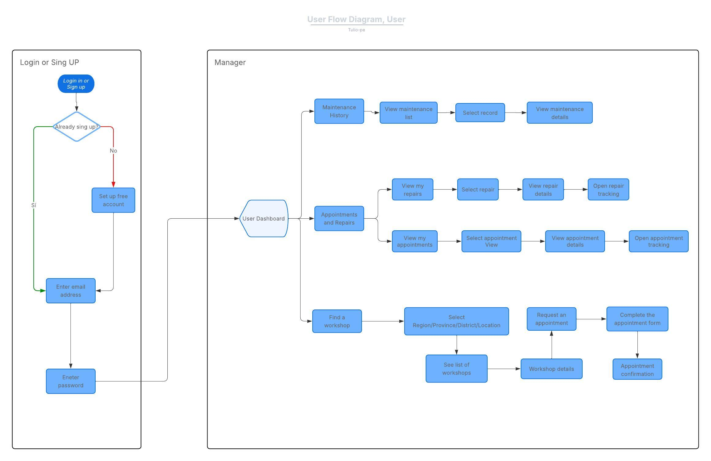
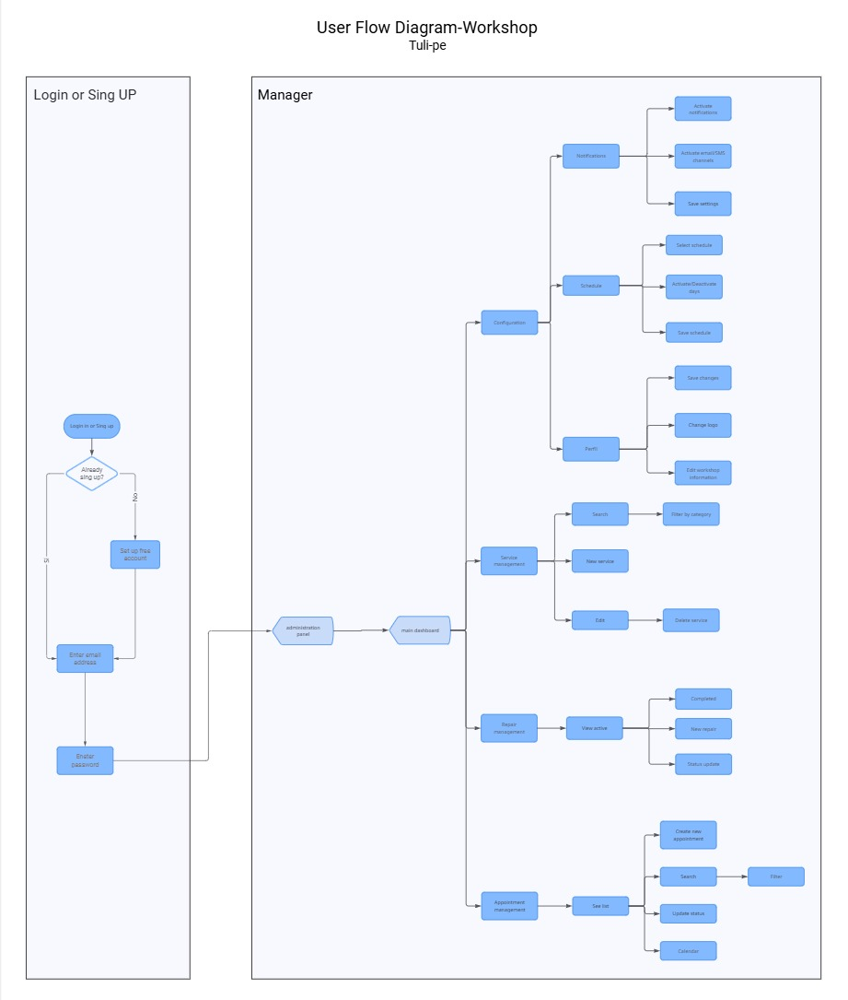

## 4.1. Style Guidelines

Nuestra plataforma Tallerazo tiene como objetivo principal transformar la experiencia del servicio automotriz, conectando a conductores y talleres de manera eficiente, confiable y digitalizada. A través de una interfaz moderna y simple e intuitiva, Tallerazo permite agendar citas, realizar seguimientos en tiempo real y mantener una comunicación directa entre ambas partes. El diseño visual de nuestro sistema está centrado en generar confianza, facilitar la navegación y transmitir innovación tecnológica. Se busca ofrecer a los usuarios una experiencia intuitiva, accesible y profesional, entregándoles transparencia y la interacción fluida en cada punto de contacto. Nuestra línea visual apunta a mantener una identidad limpia, clara y moderna, utilizando colores que transmiten frescura y profesionalismo, tipografías fácilmente entendibles y una estructura de contenidos optimizada para diferentes dispositivos.

### 4.1.1. General Style Guidelines:

### 🟩Branding:

Tallerazo es una plataforma que conecta a propietarios de vehículos con talleres automotrices de confianza, ofreciendo una experiencia digital moderna y segura. Su identidad visual refleja los valores de eficiencia, transparencia y profesionalismo.
El diseño busca transmitir confianza y dinamismo, utilizando una interfaz limpia, moderna y enfocada en la acción rápida. Con una paleta de colores frescos en azul y verde, combinada con elementos gráficos claros como el automóvil y la llave inglesa, la aplicación facilita la navegación, la gestión de servicios y la conexión directa entre conductor y taller.

### 🟩Typography:

Se hará uso de la tipografía Inter. Este tipo de letra es moderna, profesional y altamente legible, diseñada especialmente para pantallas digitales. Inter ofrece una excelente lectura en diferentes dispositivos y resoluciones, gracias a su estructura limpia, sus proporciones equilibradas y su optimización para contenido web y móvil. Es ideal para títulos, subtítulos y cuerpos de texto, permitiendo transmitir un tono confiable y accesible.

### 🟩Colors:

La paleta de colores de Tallerazo está basada en tonos de azul y verde, transmitiendo modernidad, confianza y tecnología. El fondo blanco y los acentos en azul y verde permiten una navegación ligera y placentera, evitando la saturación visual.

## Principal:

#1D4ED8 – Azul intenso: Para botones principales y llamadas a la acción.

#22C55E – Verde brillante: Para destacar acciones positivas o confirmaciones.

Fondo:

#FFFFFF – Blanco: Color de fondo predominante para mantener una sensación de limpieza.

   

### Tone of Communication:

✅Confiable: Se priorizará un lenguaje que transmita seguridad, respaldando cada interacción entre usuario y taller.

✅Ágil: El tono será claro y directo, permitiendo a los usuarios encontrar soluciones o acciones rápidamente.

✅Humano: El estilo será cercano y accesible, buscando generar una conexión genuina.

✅Profesional: Se mantendrá siempre un enfoque formal y técnico en secciones como condiciones de servicio, políticas y soporte.

✅Motivador: Se destacarán logros como el seguimiento exitoso de un servicio o el cumplimiento de citas.

### 4.1.2. Web Style Guidelines

Dado que Tallerazo está enfocado en facilitar el acceso a servicios automotrices de manera ágil, la interfaz web ha sido diseñada para ofrecer una navegación limpia y sin distracciones. Se prioriza la simplicidad, evitando el exceso de botones o elementos saturados. La landing page cumple una función de recepción, informando de forma clara las ventajas de la plataforma y guiando al usuario rápidamente a la acción deseada: registrarse y agendar su primera cita. El uso de fondos blancos, degradados suaves en azul y verde, y botones destacados en azul intenso, permite un entorno visualmente agradable, moderno y fácil de usar tanto en computadoras como en móviles.

## 4.2. Information Architecture:

La arquitectura de la información de Tallerazo ha sido diseñada para ofrecer una experiencia simple, intuitiva y confiable, enfocada en conectar a propietarios de vehículos con talleres automotrices de manera eficiente y transparente. La organización y etiquetado del contenido permiten a los usuarios identificar rápidamente los servicios, agendar citas y seguir el estado de sus reparaciones, priorizando la facilidad de uso, el control del proceso y la confianza. Esta arquitectura se implementa mediante jerarquías visuales claras, categorización por funciones específicas, acciones directas y navegación centrada en el usuario.

### 4.2.1. Organization Systems:

Hemos diseñado el sistema de organización de tallerazo para atender las necesidades específicas de los dos principales perfiles de usuarios: propietarios de vehículos (clientes) y talleres automotrices (proveedores). Aunque ambas audiencias acceden a funcionalidades similares, el enfoque y flujo de navegación cambia de acuerdo al tipo de usuario, garantizando una experiencia personalizada.

## Propietarios de Vehículos:

Los usuarios acceden a una interfaz pensada para facilitar la gestión de citas, el seguimiento de servicios y la comunicación directa con talleres. Se utiliza una estructura jerárquica que destaca primero las acciones prioritarias y los estados activos del vehículo.

🟩Inicio: Organización matricial de módulos visuales que muestra servicios disponibles, próximos seguimientos, citas activas y mensajes recientes del taller. Cada sección permite un acceso inmediato a las acciones principales.

🟩Agenda de Citas: Visualización jerárquica tipo calendario que presenta las citas programadas, con opciones rápidas para reprogramar o cancelar.

🟩Seguimiento de Servicio: Organización secuencial que permite al usuario ver el progreso de su vehículo en tiempo real, detallando fases de diagnóstico, reparación y finalización.

🟩Historial del Vehículo: Organización cronológica, donde se almacenan registros de servicios anteriores, cotizaciones, fotos de reparaciones y evaluaciones recibidas.

🟩FAQ / Soporte: Organización temática por preguntas frecuentes y asistencia rápida en casos de cambios de cita, cancelaciones o consultas sobre el estado de servicio.

## Talleres Automotrices:

El módulo para talleres está orientado a la gestión operativa de servicios, seguimiento de citas y comunicación con clientes. Se aplica una organización matricial enfocada en optimizar los procesos internos y mejorar la atención al usuario.

🟩Agenda de Trabajo: Vista de calendario diario, organizada por horarios y tipo de servicio. Permite la visualización inmediata de las citas asignadas y los servicios en progreso.

🟩Gestión de Clientes: Organización jerárquica que lista a los propietarios de vehículos, permitiendo contacto rápido, visualización del historial de servicios y asignación de técnicos.

🟩Control de Progresos: Organización secuencial que facilita el seguimiento interno de cada servicio, desde el diagnóstico inicial hasta la entrega del vehículo.

🟩Perfil del Taller: Sección jerárquica que permite administrar la información pública del taller, servicios disponibles, precios estimados y calificaciones recibidas.

🟩Capacitación y Actualización: Acceso a módulos de formación y guías prácticas orientadas a mejorar la calidad del servicio ofrecido y fomentar buenas prácticas operativas.

### 4.2.2. Labeling Systems

Las etiquetas utilizadas en la plataforma Tallerazo priorizan la claridad, simplicidad y orientación a la acción. Se evita el uso de términos técnicos complejos, optando por palabras clave comprensibles y directas, que guíen al usuario de manera intuitiva a través de las funcionalidades principales.

### Landing Page:

| Etiqueta          | Descripción                                                                                              |
| ----------------- | -------------------------------------------------------------------------------------------------------- |
| Home              | PPresenta el mensaje principal de la plataforma y acceso a los servicios destacados.                     |
| Servicios         | Acceso directo a las funciones principales: gestión de citas, seguimiento en tiempo real y comunicación. |
| Nosotros          | Sección informativa sobre la misión, visión y valores de Tallerazo.                                      |
| Empezar           | Botón CTA para iniciar el proceso de registro o navegación en los servicios.                             |
| Agendar Cita      | Botón para acceder directamente a la agenda de citas disponibles en talleres.                            |
| Seguir Reparación | Botón que permite al usuario visualizar el estado actual de su servicio automotriz.                      |
| Contact Support   | Campo para ingresar correo y enviar consulta                                                             |
| Contactar Taller  | Enlace directo para iniciar comunicación con el taller asignado.                                         |

### Interfaces de Login / Registro:

| Etiqueta                         | Descripción                                                         |
| -------------------------------- | ------------------------------------------------------------------- |
| Email                            | Campo de ingreso para correo electrónico                            |
| Password                         | Campo de ingreso para contraseña                                    |
| Iniciar sesión                   | Botón para usuarios registrados que desean acceder a su cuenta.     |
| Crear cuenta                     | Botón para nuevos usuarios que desean registrarse en la plataforma. |
| ¿Ya tienes cuenta? Inicia sesión | Enlace alternativo para cambiar entre registro e inicio de sesión.  |

### 4.2.3. SEO Tags and Meta Tags:

🟩Title: Tallerazo – Conecta con talleres de confianza y gestiona tu vehículo en línea

🟩Meta Description: Plataforma innovadora para agendar citas, seguir reparaciones en tiempo real y comunicarte directamente con talleres automotrices. Vive una experiencia automotriz más transparente y digitalizada.

🟩Keywords: talleres mecánicos, servicio automotriz, agendar cita taller, seguimiento de reparaciones, Tallerazo Perú, plataforma de talleres

🟩Author: Tallerazo Team

### Servicios:

🟩Title: Servicios Tallerazo – Agenda, Sigue y Comunica tu reparación automotriz

🟩Meta Description: Descubre cómo agendar citas en talleres de confianza, seguir el avance de tu reparación en tiempo real y comunicarte directamente con tu mecánico a través de Tallerazo.

🟩Keywords: cita taller online, reparaciones en tiempo real, comunicación con talleres, servicios automotrices digitales, Tallerazo.

### Seguimiento de Reparaciones:

🟩Title: Seguimiento Tallerazo – Control total de la reparación de tu vehículo

🟩Meta Description: Revisa en tiempo real el estado de tu vehículo en proceso de reparación. Tallerazo te ofrece control y transparencia en cada etapa de tu servicio automotriz.

🟩Keywords: seguimiento de reparaciones, control de servicio automotriz, avance reparación taller, servicio transparente, Tallerazo

### 4.2.4. Searching Systems:

| Filtro           | Descripción                                                                                                                           |
| ---------------- | ------------------------------------------------------------------------------------------------------------------------------------- |
| Buscar en FAQ    | Permite ingresar palabras clave relacionadas a citas, reparaciones, seguimiento de vehículos o problemas frecuentes en la plataforma. |
| Filtrar por Plan | Permite ver únicamente los servicios según su estado actual (En diagnóstico, En reparación, Listo para entrega).                      |
| Buscar Servicio  | Navegación rápida para encontrar talleres disponibles según ubicación, tipo de servicio o reputación.                                 |

### 4.2.5. Navigation Systems:

El sistema de navegación de Tallerazo ha sido diseñado para facilitar el recorrido del usuario tanto en la landing page como dentro de la aplicación, garantizando una experiencia fluida, clara y enfocada en el cumplimiento de objetivos. La navegación se basa en principios de diseño centrado en el usuario, utilizando estructuras modernas que aseguran accesibilidad, claridad y bajo esfuerzo cognitivo.

## Landing Page

Estructura: Presentación general de MascotaMatch con llamada a la acción visible, acceso a servicios, planes, preguntas frecuentes y contacto.

- **Estructura:** Presentación general de Tallerazo con llamado a la acción visible, acceso a servicios, gestión de citas, seguimiento de reparaciones y contacto.
- **Incluye acceso rápido a:**
  - Registro / Inicio de sesión
  - Agendar cita
  - Seguir reparación
  - Servicios destacados
  - Contactar taller
- **Acción del Usuario:** Explorar contenido, agendar servicios, seguir el avance de su vehículo, contactar con talleres y resolver dudas operativas.

#### Aplicación Web – Clientes

- **Inicio:**
  - Muestra citas activas, próximos seguimientos y acceso directo a historial de servicios.
  - Organización matricial con bloques de acción rápida.
- **Agenda de citas:**
  - Visualización de citas programadas en formato calendario.
  - Botones rápidos para reprogramar o cancelar.
- **Seguimiento de Servicio:**
  - Vista secuencial del avance de la reparación.
  - Indicadores de progreso por fases (Diagnóstico, Reparación, Entrega).
- **Historial del Vehículo:**
  - Listado cronológico de servicios anteriores, incluyendo cotizaciones y documentos adjuntos.
- **Soporte:**
- Acceso directo a FAQs y contacto con soporte desde el menú principal.

#### Aplicación Web – Talleres

- **Inicio:**
  - Vista resumida de citas próximas, servicios activos y alertas de seguimiento.
- **Agenda de trabajo:**
  - Calendario organizado por hora y tipo de servicio.
- **Clientes asignados:**
  - Listado diario de propietarios con acceso a la ficha de servicio e historial del vehículo.
- **Perfil del taller:**
  - Sección para administrar información pública, servicios disponibles, precios y reputación recibida.
- **Capacitación / Recursos:**
  - Acceso a materiales de actualización profesional y mejores prácticas de atención automotriz.

## 4.3. Landing Page UI Design

### 4.3.1. Landing Page Wireframe

Esquema inicial de la página de aterrizaje.

### 4.3.2. Landing Page Mock-up

Prototipo visual de la página de aterrizaje.

## 4.4. Web Applications UX/UI Design

### 4.4.1. Web Applications Wireframes

Esquemas iniciales para aplicaciones web.

### VISTA DEL USUARIO

#### Dashboard principal

#### Detalles del taller

#### Agendar cita en el taller

### VISTA DEL TALLER

### 4.4.2. Web Applications Wireflow Diagrams

Diagramas de flujo de interacción para aplicaciones web.

#### Gestor de taller

#### Conductor

### 4.4.3. Web Applications Mock-ups

Prototipos visuales para aplicaciones web.

### VISTA DEL USUARIO

#### Dashboard principal

#### Detalles de un taller

#### Agendar Cita

#### Seguimiento de citas

#### Detalles de la cita

#### Seguimiento de reparaciones users

#### Detalles de las repaciones

### VISTA DEL TALLER

#### Dashboard Principal

#### Gestión de citas del taller

### Gestión de las reparaciones

### Configuración de los servicios

### Configuración del perfil de taller

### Configuración de los horarios

### Configuración de Notificaciones

### 4.4.4. Web Applications User Flow Diagrams

#### USUARIO

#### TALLER

## 4.6. Domain-Driven Software Architecture

### 4.6.1. Software Architecture Context Diagram

### 4.6.2. Software Architecture Container Diagrams

### *Diagramas de contenedores de la arquitectura de software.*

### 4.6.3. Software Architecture Components Diagrams

### *Diagramas de componentes del frontend.*

### *Workshop*

### *Workshop Discovery*

### *Vehicle Tracking*

### *Shared*

### *IAM*

### *Diagramas de componentes del backend.*

### *Workshop Managment*

### *Shared*

### *IAM*

## 4.7. Software Object-Oriented Design

### 4.7.1. Class Diagrams

### Diagrama de clases del backend

diagrama del bounded context WorkshopManagment

diagrama del bounded context RepairManagment

diagrama del bounded context IAM

### 4.7.2. Class Dictionary

### Clase `User` (Entity)
<table border="1" cellspacing="0" cellpadding="5">
  <caption><strong>Atributos</strong></caption>
  <thead>
    <tr><th>Atributo</th><th>Tipo</th><th>Descripción</th></tr>
  </thead>
  <tbody>
    <tr><td>userId</td><td>int</td><td>Identificador único del usuario.</td></tr>
    <tr><td>username</td><td>string</td><td>Nombre de usuario para inicio de sesión.</td></tr>
    <tr><td>email</td><td>string</td><td>Correo electrónico del usuario.</td></tr>
    <tr><td>passwordHash</td><td>string</td><td>Hash de la contraseña del usuario.</td></tr>
    <tr><td>role</td><td>UserRole</td><td>Rol asignado al usuario.</td></tr>
  </tbody>
</table>
<table border="1" cellspacing="0" cellpadding="5">
  <caption><strong>Métodos</strong></caption>
  <thead>
    <tr><th>Método</th><th>Tipo de Retorno</th><th>Descripción</th></tr>
  </thead>
  <tbody>
    <tr><td>authenticate(username, password)</td><td>boolean</td><td>Autentica al usuario en el sistema.</td></tr>
    <tr><td>changePassword(newPassword)</td><td>void</td><td>Permite al usuario cambiar su contraseña.</td></tr>
    <tr><td>assignRole(userRole)</td><td>void</td><td>Asigna un rol específico al usuario.</td></tr>
  </tbody>
</table>

---

### Clase `Role` (Entity)
<table border="1" cellspacing="0" cellpadding="5">
  <caption><strong>Atributos</strong></caption>
  <thead>
    <tr><th>Atributo</th><th>Tipo</th><th>Descripción</th></tr>
  </thead>
  <tbody>
    <tr><td>roleId</td><td>int</td><td>Identificador único del rol.</td></tr>
    <tr><td>name</td><td>string</td><td>Nombre del rol (ej. "Cliente", "Administrador de Taller", "Mecánico").</td></tr>
    <tr><td>permissions</td><td>List&lt;Permission&gt;</td><td>Lista de permisos asociados a este rol.</td></tr>
  </tbody>
</table>

---

### Clase `Permission` (Entity)
<table border="1" cellspacing="0" cellpadding="5">
  <caption><strong>Atributos</strong></caption>
  <thead>
    <tr><th>Atributo</th><th>Tipo</th><th>Descripción</th></tr>
  </thead>
  <tbody>
    <tr><td>permissionId</td><td>int</td><td>Identificador único del permiso.</td></tr>
    <tr><td>name</td><td>string</td><td>Nombre del permiso (ej. "VIEW_APPOINTMENTS", "CREATE_MAINTENANCE").</td></tr>
  </tbody>
</table>

---

### Clase `Session` (Entity)
<table border="1" cellspacing="0" cellpadding="5">
  <caption><strong>Atributos</strong></caption>
  <thead>
    <tr><th>Atributo</th><th>Tipo</th><th>Descripción</th></tr>
  </thead>
  <tbody>
    <tr><td>sessionId</td><td>string</td><td>Identificador único de la sesión.</td></tr>
    <tr><td>userId</td><td>int</td><td>ID del usuario asociado a la sesión.</td></tr>
    <tr><td>expirationTime</td><td>DateTime</td><td>Tiempo de expiración de la sesión.</td></tr>
    <tr><td>isActive</td><td>boolean</td><td>Indica si la sesión está activa.</td></tr>
  </tbody>
</table>
<table border="1" cellspacing="0" cellpadding="5">
  <caption><strong>Métodos</strong></caption>
  <thead>
    <tr><th>Método</th><th>Tipo de Retorno</th><th>Descripción</th></tr>
  </thead>
  <tbody>
    <tr><td>generateToken()</td><td>string</td><td>Genera un token de sesión seguro.</td></tr>
    <tr><td>invalidateSession()</td><td>void</td><td>Invalida la sesión actual.</td></tr>
  </tbody>
</table>

---

<h2>Bounded Context WorkShopManagement</h2>

### Clase `Workshop` (Aggregate)
<table border="1" cellspacing="0" cellpadding="5">
  <caption><strong>Atributos</strong></caption>
  <thead>
    <tr><th>Atributo</th><th>Tipo</th><th>Descripción</th></tr>
  </thead>
  <tbody>
    <tr><td>id</td><td>Long</td><td>Identificador único del taller (ID del agregado).</td></tr>
    <tr><td>managerId</td><td>Manager_id</td><td>Identificador del gerente asociado al taller (Value Object).</td></tr>
    <tr><td>name</td><td>WorkshopName</td><td>Nombre del taller (Value Object).</td></tr>
    <tr><td>address</td><td>WorkshopAddress</td><td>Dirección del taller (Value Object).</td></tr>
    <tr><td>phone</td><td>WorkshopPhone</td><td>Número de teléfono del taller (Value Object).</td></tr>
    <tr><td>email</td><td>WorkshopEmail</td><td>Correo electrónico del taller (Value Object).</td></tr>
    <tr><td>description</td><td>WorkshopDescription</td><td>Descripción del taller (Value Object).</td></tr>
    <tr><td>photos</td><td>List&lt;Photo&gt;</td><td>Lista de fotos del taller (Value Object).</td></tr>
    <tr><td>services</td><td>List&lt;Service&gt;</td><td>Lista de servicios que ofrece el taller (Entidades).</td></tr>
  </tbody>
</table>
<table border="1" cellspacing="0" cellpadding="5">
  <caption><strong>Métodos</strong></caption>
  <thead>
    <tr><th>Método</th><th>Tipo de Retorno</th><th>Descripción</th></tr>
  </thead>
  <tbody>
    <tr><td>createWorkshop(command)</td><td>Workshop</td><td>Crea una nueva instancia de taller (constructor/método de fábrica).</td></tr>
    <tr><td>addService(service)</td><td>void</td><td>Añade un servicio al taller.</td></tr>
    <tr><td>updateDetails(command)</td><td>void</td><td>Actualiza los detalles básicos del taller.</td></tr>
  </tbody>
</table>

---

### Clase `Service` (Entity)
<table border="1" cellspacing="0" cellpadding="5">
  <caption><strong>Atributos</strong></caption>
  <thead>
    <tr><th>Atributo</th><th>Tipo</th><th>Descripción</th></tr>
  </thead>
  <tbody>
    <tr><td>id</td><td>Long</td><td>Identificador único del servicio.</td></tr>
    <tr><td>name</td><td>String</td><td>Nombre del servicio (ej. "Cambio de aceite").</td></tr>
    <tr><td>description</td><td>String</td><td>Descripción del servicio.</td></tr>
    <tr><td>price</td><td>Double</td><td>Precio del servicio.</td></tr>
  </tbody>
</table>
<table border="1" cellspacing="0" cellpadding="5">
  <caption><strong>Métodos</strong></caption>
  <thead>
    <tr><th>Método</th><th>Tipo de Retorno</th><th>Descripción</th></tr>
  </thead>
  <tbody>
    <tr><td>updateInfo(name, description, price)</td><td>void</td><td>Actualiza la información del servicio.</td></tr>
  </tbody>
</table>

---

### Clase `Manager_id` (Value Object)
<table border="1" cellspacing="0" cellpadding="5">
  <caption><strong>Atributos</strong></caption>
  <thead>
    <tr><th>Atributo</th><th>Tipo</th><th>Descripción</th></tr>
  </thead>
  <tbody>
    <tr><td>value</td><td>Long</td><td>ID del gerente.</td></tr>
  </tbody>
</table>

---

### Clase `Photo` (Value Object)
<table border="1" cellspacing="0" cellpadding="5">
  <caption><strong>Atributos</strong></caption>
  <thead>
    <tr><th>Atributo</th><th>Tipo</th><th>Descripción</th></tr>
  </thead>
  <tbody>
    <tr><td>url</td><td>String</td><td>URL de la imagen de la foto.</td></tr>
  </tbody>
</table>

---

### Clase `WorkshopAddress` (Value Object)
<table border="1" cellspacing="0" cellpadding="5">
  <caption><strong>Atributos</strong></caption>
  <thead>
    <tr><th>Atributo</th><th>Tipo</th><th>Descripción</th></tr>
  </thead>
  <tbody>
    <tr><td>street</td><td>String</td><td>Calle y número.</td></tr>
    <tr><td>city</td><td>String</td><td>Ciudad.</td></tr>
    <tr><td>postalCode</td><td>String</td><td>Código postal.</td></tr>
  </tbody>
</table>

---

### Clase `WorkshopDescription` (Value Object)
<table border="1" cellspacing="0" cellpadding="5">
  <caption><strong>Atributos</strong></caption>
  <thead>
    <tr><th>Atributo</th><th>Tipo</th><th>Descripción</th></tr>
  </thead>
  <tbody>
    <tr><td>value</td><td>String</td><td>Texto de descripción del taller.</td></tr>
  </tbody>
</table>

---

### Clase `WorkshopEmail` (Value Object)
<table border="1" cellspacing="0" cellpadding="5">
  <caption><strong>Atributos</strong></caption>
  <thead>
    <tr><th>Atributo</th><th>Tipo</th><th>Descripción</th></tr>
  </thead>
  <tbody>
    <tr><td>value</td><td>String</td><td>Dirección de correo electrónico del taller.</td></tr>
  </tbody>
</table>

---

### Clase `WorkshopName` (Value Object)
<table border="1" cellspacing="0" cellpadding="5">
  <caption><strong>Atributos</strong></caption>
  <thead>
    <tr><th>Atributo</th><th>Tipo</th><th>Descripción</th></tr>
  </thead>
  <tbody>
    <tr><td>value</td><td>String</td><td>Nombre oficial del taller.</td></tr>
  </tbody>
</table>

---

### Clase `WorkshopPhone` (Value Object)
<table border="1" cellspacing="0" cellpadding="5">
  <caption><strong>Atributos</strong></caption>
  <thead>
    <tr><th>Atributo</th><th>Tipo</th><th>Descripción</th></tr>
  </thead>
  <tbody>
    <tr><td>value</td><td>String</td><td>Número de teléfono de contacto del taller.</td></tr>
  </tbody>
</table>

---

### Clase `WorkshopServices` (Value Object)
<table border="1" cellspacing="0" cellpadding="5">
  <caption><strong>Atributos</strong></caption>
  <thead>
    <tr><th>Atributo</th><th>Tipo</th><th>Descripción</th></tr>
  </thead>
  <tbody>
    <tr><td>serviceIds</td><td>List&lt;Long&gt;</td><td>Lista de IDs de servicios ofrecidos por el taller (quizás una representación más ligera).</td></tr>
  </tbody>
</table>

---

### Clase `CreateWorkshopCommand` (Command)
<table border="1" cellspacing="0" cellpadding="5">
  <caption><strong>Atributos</strong></caption>
  <thead>
    <tr><th>Atributo</th><th>Tipo</th><th>Descripción</th></tr>
  </thead>
  <tbody>
    <tr><td>managerId</td><td>Long</td><td>ID del gerente que crea el taller.</td></tr>
    <tr><td>name</td><td>String</td><td>Nombre del taller a crear.</td></tr>
    <tr><td>address</td><td>String</td><td>Dirección del taller.</td></tr>
    <tr><td>phone</td><td>String</td><td>Teléfono del taller.</td></tr>
    <tr><td>email</td><td>String</td><td>Email del taller.</td></tr>
    <tr><td>description</td><td>String</td><td>Descripción del taller.</td></tr>
    <tr><td>photoUrls</td><td>List&lt;String&gt;</td><td>URLs de las fotos iniciales del taller.</td></tr>
  </tbody>
</table>

---

### Clase `SeedServicesCommand` (Command)
<table border="1" cellspacing="0" cellpadding="5">
  <caption><strong>Atributos</strong></caption>
  <thead>
    <tr><th>Atributo</th><th>Tipo</th><th>Descripción</th></tr>
  </thead>
  <tbody>
    <tr><td>workshopId</td><td>Long</td><td>ID del taller al que se agregarán los servicios.</td></tr>
    <tr><td>serviceNames</td><td>List&lt;String&gt;</td><td>Nombres de los servicios a añadir.</td></tr>
  </tbody>
</table>

---

### Clase `GetServiceByNameQuery` (Query)
<table border="1" cellspacing="0" cellpadding="5">
  <caption><strong>Atributos</strong></caption>
  <thead>
    <tr><th>Atributo</th><th>Tipo</th><th>Descripción</th></tr>
  </thead>
  <tbody>
    <tr><td>name</td><td>String</td><td>Nombre del servicio a buscar.</td></tr>
  </tbody>
</table>

---

### Clase `GetWorkshopByNameQuery` (Query)
<table border="1" cellspacing="0" cellpadding="5">
  <caption><strong>Atributos</strong></caption>
  <thead>
    <tr><th>Atributo</th><th>Tipo</th><th>Descripción</th></tr>
  </thead>
  <tbody>
    <tr><td>name</td><td>String</td><td>Nombre del taller a buscar.</td></tr>
  </tbody>
</table>

---

### Interfaz `ServiceCommandService` (Service Interface)
<table border="1" cellspacing="0" cellpadding="5">
  <caption><strong>Métodos</strong></caption>
  <thead>
    <tr><th>Método</th><th>Tipo de Retorno</th><th>Descripción</th></tr>
  </thead>
  <tbody>
    <tr><td>createService(command)</td><td>Service</td><td>Crea un nuevo servicio.</td></tr>
    <tr><td>updateService(command)</td><td>Service</td><td>Actualiza un servicio existente.</td></tr>
  </tbody>
</table>

---

### Clase `ServiceCommandServiceImpl` (Service Implementation)
<table border="1" cellspacing="0" cellpadding="5">
  <caption><strong>Atributos</strong></caption>
  <thead>
    <tr><th>Atributo</th><th>Tipo</th><th>Descripción</th></tr>
  </thead>
  <tbody>
    <tr><td>serviceRepository</td><td>ServiceRepository</td><td>Repositorio para interactuar con la persistencia de Service.</td></tr>
  </tbody>
</table>
<table border="1" cellspacing="0" cellpadding="5">
  <caption><strong>Métodos</strong></caption>
  <thead>
    <tr><th>Método</th><th>Tipo de Retorno</th><th>Descripción</th></tr>
  </thead>
  <tbody>
    <tr><td>createService(command)</td><td>Service</td><td>Implementación para crear un servicio.</td></tr>
    <tr><td>updateService(command)</td><td>Service</td><td>Implementación para actualizar un servicio.</td></tr>
  </tbody>
</table>

---

### Interfaz `ServiceQueryService` (Service Interface)
<table border="1" cellspacing="0" cellpadding="5">
  <caption><strong>Métodos</strong></caption>
  <thead>
    <tr><th>Método</th><th>Tipo de Retorno</th><th>Descripción</th></tr>
  </thead>
  <tbody>
    <tr><td>getServiceByName(query)</td><td>Service</td><td>Obtiene un servicio por su nombre.</td></tr>
    <tr><td>getAllServices()</td><td>List&lt;Service&gt;</td><td>Obtiene todos los servicios.</td></tr>
  </tbody>
</table>

---

### Clase `ServiceQueryServiceImpl` (Service Implementation)
<table border="1" cellspacing="0" cellpadding="5">
  <caption><strong>Atributos</strong></caption>
  <thead>
    <tr><th>Atributo</th><th>Tipo</th><th>Descripción</th></tr>
  </thead>
  <tbody>
    <tr><td>serviceRepository</td><td>ServiceRepository</td><td>Repositorio para interactuar con la persistencia de Service.</td></tr>
  </tbody>
</table>
<table border="1" cellspacing="0" cellpadding="5">
  <caption><strong>Métodos</strong></caption>
  <thead>
    <tr><th>Método</th><th>Tipo de Retorno</th><th>Descripción</th></tr>
  </thead>
  <tbody>
    <tr><td>getServiceByName(query)</td><td>Service</td><td>Implementación para obtener un servicio por nombre.</td></tr>
    <tr><td>getAllServices()</td><td>List&lt;Service&gt;</td><td>Implementación para obtener todos los servicios.</td></tr>
  </tbody>
</table>

---

### Interfaz `WorkshopCommandService` (Service Interface)
<table border="1" cellspacing="0" cellpadding="5">
  <caption><strong>Métodos</strong></caption>
  <thead>
    <tr><th>Método</th><th>Tipo de Retorno</th><th>Descripción</th></tr>
  </thead>
  <tbody>
    <tr><td>createWorkshop(command)</td><td>Workshop</td><td>Crea un nuevo taller.</td></tr>
    <tr><td>addServicesToWorkshop(command)</td><td>void</td><td>Añade servicios a un taller existente.</td></tr>
  </tbody>
</table>

---

### Clase `WorkshopCommandServiceImpl` (Service Implementation)
<table border="1" cellspacing="0" cellpadding="5">
  <caption><strong>Atributos</strong></caption>
  <thead>
    <tr><th>Atributo</th><th>Tipo</th><th>Descripción</th></tr>
  </thead>
  <tbody>
    <tr><td>workshopRepository</td><td>WorkshopRepository</td><td>Repositorio para interactuar con la persistencia de Workshop.</td></tr>
  </tbody>
</table>
<table border="1" cellspacing="0" cellpadding="5">
  <caption><strong>Métodos</strong></caption>
  <thead>
    <tr><th>Método</th><th>Tipo de Retorno</th><th>Descripción</th></tr>
  </thead>
  <tbody>
    <tr><td>createWorkshop(command)</td><td>Workshop</td><td>Implementación para crear un taller.</td></tr>
    <tr><td>addServicesToWorkshop(command)</td><td>void</td><td>Implementación para añadir servicios a un taller.</td></tr>
  </tbody>
</table>

---

### Interfaz `WorkshopQueryService` (Service Interface)
<table border="1" cellspacing="0" cellpadding="5">
  <caption><strong>Métodos</strong></caption>
  <thead>
    <tr><th>Método</th><th>Tipo de Retorno</th><th>Descripción</th></tr>
  </thead>
  <tbody>
    <tr><td>getWorkshopByName(query)</td><td>Workshop</td><td>Obtiene un taller por su nombre.</td></tr>
    <tr><td>getWorkshopById(id)</td><td>Workshop</td><td>Obtiene un taller por su ID.</td></tr>
  </tbody>
</table>

---

### Clase `WorkshopQueryServiceImpl` (Service Implementation)
<table border="1" cellspacing="0" cellpadding="5">
  <caption><strong>Atributos</strong></caption>
  <thead>
    <tr><th>Atributo</th><th>Tipo</th><th>Descripción</th></tr>
  </thead>
  <tbody>
    <tr><td>workshopRepository</td><td>WorkshopRepository</td><td>Repositorio para interactuar con la persistencia de Workshop.</td></tr>
  </tbody>
</table>
<table border="1" cellspacing="0" cellpadding="5">
  <caption><strong>Métodos</strong></caption>
  <thead>
    <tr><th>Método</th><th>Tipo de Retorno</th><th>Descripción</th></tr>
  </thead>
  <tbody>
    <tr><td>getWorkshopByName(query)</td><td>Workshop</td><td>Implementación para obtener un taller por nombre.</td></tr>
    <tr><td>getWorkshopById(id)</td><td>Workshop</td><td>Implementación para obtener un taller por ID.</td></tr>
  </tbody>
</table>

---

### Interfaz `ServiceRepository` (Repository Interface)
<table border="1" cellspacing="0" cellpadding="5">
  <caption><strong>Métodos</strong></caption>
  <thead>
    <tr><th>Método</th><th>Tipo de Retorno</th><th>Descripción</th></tr>
  </thead>
  <tbody>
    <tr><td>save(service)</td><td>Service</td><td>Guarda o actualiza un servicio en la base de datos.</td></tr>
    <tr><td>findById(id)</td><td>Optional&lt;Service&gt;</td><td>Busca un servicio por su ID.</td></tr>
    <tr><td>findByName(name)</td><td>Optional&lt;Service&gt;</td><td>Busca un servicio por su nombre.</td></tr>
  </tbody>
</table>

---

### Interfaz `WorkshopRepository` (Repository Interface)
<table border="1" cellspacing="0" cellpadding="5">
  <caption><strong>Métodos</strong></caption>
  <thead>
    <tr><th>Método</th><th>Tipo de Retorno</th><th>Descripción</th></tr>
  </thead>
  <tbody>
    <tr><td>save(workshop)</td><td>Workshop</td><td>Guarda o actualiza un taller en la base de datos.</td></tr>
    <tr><td>findById(id)</td><td>Optional&lt;Workshop&gt;</td><td>Busca un taller por su ID.</td></tr>
    <tr><td>findByName(name)</td><td>Optional&lt;Workshop&gt;</td><td>Busca un taller por su nombre.</td></tr>
  </tbody>
</table>

---

### Clase `CreateWorkshopResource` (REST Resource / DTO)
<table border="1" cellspacing="0" cellpadding="5">
  <caption><strong>Atributos</strong></caption>
  <thead>
    <tr><th>Atributo</th><th>Tipo</th><th>Descripción</th></tr>
  </thead>
  <tbody>
    <tr><td>managerId</td><td>Long</td><td>ID del gerente para la creación del taller.</td></tr>
    <tr><td>name</td><td>String</td><td>Nombre del taller.</td></tr>
    <tr><td>address</td><td>String</td><td>Dirección del taller.</td></tr>
    <tr><td>phone</td><td>String</td><td>Teléfono del taller.</td></tr>
    <tr><td>email</td><td>String</td><td>Email del taller.</td></tr>
    <tr><td>description</td><td>String</td><td>Descripción del taller.</td></tr>
    <tr><td>photoUrls</td><td>List&lt;String&gt;</td><td>URLs de las fotos.</td></tr>
  </tbody>
</table>

---

### Clase `WorkshopResource` (REST Resource / DTO)
<table border="1" cellspacing="0" cellpadding="5">
  <caption><strong>Atributos</strong></caption>
  <thead>
    <tr><th>Atributo</th><th>Tipo</th><th>Descripción</th></tr>
  </thead>
  <tbody>
    <tr><td>id</td><td>Long</td><td>ID del taller.</td></tr>
    <tr><td>managerId</td><td>Long</td><td>ID del gerente.</td></tr>
    <tr><td>name</td><td>String</td><td>Nombre del taller.</td></tr>
    <tr><td>address</td><td>String</td><td>Dirección del taller.</td></tr>
    <tr><td>phone</td><td>String</td><td>Teléfono del taller.</td></tr>
    <tr><td>email</td><td>String</td><td>Email del taller.</td></tr>
    <tr><td>description</td><td>String</td><td>Descripción del taller.</td></tr>
    <tr><td>photoUrls</td><td>List&lt;String&gt;</td><td>URLs de las fotos.</td></tr>
    <tr><td>serviceNames</td><td>List&lt;String&gt;</td><td>Nombres de los servicios del taller.</td></tr>
  </tbody>
</table>

---

### Clase `CreateWorkshopCommandFromResourceAssembler` (Assembler)
<table border="1" cellspacing="0" cellpadding="5">
  <caption><strong>Métodos</strong></caption>
  <thead>
    <tr><th>Método</th><th>Tipo de Retorno</th><th>Descripción</th></tr>
  </thead>
  <tbody>
    <tr><td>toCommand(resource)</td><td>CreateWorkshopCommand</td><td>Convierte un `CreateWorkshopResource` en un `CreateWorkshopCommand`.</td></tr>
  </tbody>
</table>

---

### Clase `WorkshopResourceFromEntityAssembler` (Assembler)
<table border="1" cellspacing="0" cellpadding="5">
  <caption><strong>Métodos</strong></caption>
  <thead>
    <tr><th>Método</th><th>Tipo de Retorno</th><th>Descripción</th></tr>
  </thead>
  <tbody>
    <tr><td>toResource(workshop)</td><td>WorkshopResource</td><td>Convierte una entidad `Workshop` en un `WorkshopResource` para la respuesta.</td></tr>
  </tbody>
</table>

---

### Clase `WorkshopsController` (Controller)
<table border="1" cellspacing="0" cellpadding="5">
  <caption><strong>Atributos</strong></caption>
  <thead>
    <tr><th>Atributo</th><th>Tipo</th><th>Descripción</th></tr>
  </thead>
  <tbody>
    <tr><td>workshopCommandService</td><td>WorkshopCommandService</td><td>Servicio para ejecutar comandos relacionados con talleres.</td></tr>
    <tr><td>workshopQueryService</td><td>WorkshopQueryService</td><td>Servicio para ejecutar consultas relacionadas con talleres.</td></tr>
    <tr><td>createAssembler</td><td>CreateWorkshopCommandFromResourceAssembler</td><td>Ensamblador para comandos de creación.</td></tr>
    <tr><td>resourceAssembler</td><td>WorkshopResourceFromEntityAssembler</td><td>Ensamblador para recursos de taller.</td></tr>
  </tbody>
</table>
<table border="1" cellspacing="0" cellpadding="5">
  <caption><strong>Métodos</strong></caption>
  <thead>
    <tr><th>Método</th><th>Tipo de Retorno</th><th>Descripción</th></tr>
  </thead>
  <tbody>
    <tr><td>createWorkshop(resource)</td><td>ResponseEntity&lt;WorkshopResource&gt;</td><td>Maneja la solicitud HTTP POST para crear un taller.</td></tr>
    <tr><td>getWorkshopByName(name)</td><td>ResponseEntity&lt;WorkshopResource&gt;</td><td>Maneja la solicitud HTTP GET para obtener un taller por nombre.</td></tr>
  </tbody>
</table>

---

### Clase `ApplicationReadyEventHandler` (Event Handler)
<table border="1" cellspacing="0" cellpadding="5">
  <caption><strong>Métodos</strong></caption>
  <thead>
    <tr><th>Método</th><th>Tipo de Retorno</th><th>Descripción</th></tr>
  </thead>
  <tbody>
    <tr><td>onApplicationReadyEvent(event)</td><td>void</td><td>Método que se ejecuta cuando la aplicación ha terminado de inicializarse.</td></tr>
  </tbody>
</table>

---

<h2>Bounded Context RepairManagement</h2>

### Clase `RepairOrder` (Aggregate)
<table border="1" cellspacing="0" cellpadding="5">
  <caption><strong>Atributos</strong></caption>
  <thead>
    <tr><th>Atributo</th><th>Tipo</th><th>Descripción</th></tr>
  </thead>
  <tbody>
    <tr><td>orderId</td><td>int</td><td>Identificador único de la orden de reparación.</td></tr>
    <tr><td>appointmentId</td><td>int</td><td>ID de la cita asociada a esta orden.</td></tr>
    <tr><td>vehicleId</td><td>int</td><td>ID del vehículo en reparación.</td></tr>
    <tr><td>mechanicId</td><td>int</td><td>ID del mecánico asignado.</td></tr>
    <tr><td>startDate</td><td>Date</td><td>Fecha de inicio de la reparación.</td></tr>
    <tr><td>endDate</td><td>Date</td><td>Fecha de finalización de la reparación.</td></tr>
    <tr><td>status</td><td>RepairStatus</td><td>Estado actual de la reparación (ej. En Progreso, Completada).</td></tr>
    <tr><td>totalCost</td><td>float</td><td>Costo total estimado de la reparación.</td></tr>
  </tbody>
</table>
<table border="1" cellspacing="0" cellpadding="5">
  <caption><strong>Métodos</strong></caption>
  <thead>
    <tr><th>Método</th><th>Tipo de Retorno</th><th>Descripción</th></tr>
  </thead>
  <tbody>
    <tr><td>createRepairOrder()</td><td>void</td><td>Crea una nueva orden de reparación.</td></tr>
    <tr><td>updateRepairStatus()</td><td>void</td><td>Actualiza el estado de la orden de reparación.</td></tr>
    <tr><td>addRepairPart(part)</td><td>void</td><td>Añade una pieza a la reparación.</td></tr>
  </tbody>
</table>

---

### Clase `RepairDetail` (Entity)
<table border="1" cellspacing="0" cellpadding="5">
  <caption><strong>Atributos</strong></caption>
  <thead>
    <tr><th>Atributo</th><th>Tipo</th><th>Descripción</th></tr>
  </thead>
  <tbody>
    <tr><td>detailId</td><td>int</td><td>Identificador único del detalle de reparación.</td></tr>
    <tr><td>orderId</td><td>int</td><td>ID de la orden de reparación a la que pertenece.</td></tr>
    <tr><td>description</td><td>string</td><td>Descripción específica de la tarea o pieza.</td></tr>
    <tr><td>cost</td><td>float</td><td>Costo de esta parte del detalle.</td></tr>
    <tr><td>mechanicNotes</td><td>string</td><td>Notas del mecánico sobre esta parte de la reparación.</td></tr>
  </tbody>
</table>

---

### Clase `Part` (Entity)
<table border="1" cellspacing="0" cellpadding="5">
  <caption><strong>Atributos</strong></caption>
  <thead>
    <tr><th>Atributo</th><th>Tipo</th><th>Descripción</th></tr>
  </thead>
  <tbody>
    <tr><td>partId</td><td>int</td><td>Identificador único de la pieza.</td></tr>
    <tr><td>name</td><td>string</td><td>Nombre de la pieza.</td></tr>
    <tr><td>supplier</td><td>string</td><td>Proveedor de la pieza.</td></tr>
    <tr><td>price</td><td>float</td><td>Precio unitario de la pieza.</td></tr>
    <tr><td>stock</td><td>int</td><td>Cantidad de piezas en stock.</td></tr>
  </tbody>
</table>

---

### Clase `ServicePerformed` (Entity)
<table border="1" cellspacing="0" cellpadding="5">
  <caption><strong>Atributos</strong></caption>
  <thead>
    <tr><th>Atributo</th><th>Tipo</th><th>Descripción</th></tr>
  </thead>
  <tbody>
    <tr><td>serviceId</td><td>int</td><td>Identificador único del servicio realizado.</td></tr>
    <tr><td>orderId</td><td>int</td><td>ID de la orden de reparación asociada.</td></tr>
    <tr><td>description</td><td>string</td><td>Descripción del servicio realizado.</td></tr>
    <tr><td>hoursWorked</td><td>float</td><td>Horas de trabajo dedicadas al servicio.</td></tr>
    <tr><td>costPerHour</td><td>float</td><td>Costo por hora de trabajo.</td></tr>
  </tbody>
</table>

---

### Clase `Review` (Entity)
<table border="1" cellspacing="0" cellpadding="5">
  <caption><strong>Atributos</strong></caption>
  <thead>
    <tr><th>Atributo</th><th>Tipo</th><th>Descripción</th></tr>
  </thead>
  <tbody>
    <tr><td>reviewId</td><td>int</td><td>Identificador único de la reseña.</td></tr>
    <tr><td>clientId</td><td>int</td><td>ID del cliente que realizó la reseña.</td></tr>
    <tr><td>workshopId</td><td>int</td><td>ID del taller reseñado.</td></tr>
    <tr><td>rating</td><td>int</td><td>Calificación (ej. de 1 a 5 estrellas).</td></tr>
    <tr><td>comment</td><td>string</td><td>Comentario o feedback del cliente.</td></tr>
    <tr><td>reviewDate</td><td>Date</td><td>Fecha en que se envió la reseña.</td></tr>
  </tbody>
</table>
<table border="1" cellspacing="0" cellpadding="5">
  <caption><strong>Métodos</strong></caption>
  <thead>
    <tr><th>Método</th><th>Tipo de Retorno</th><th>Descripción</th></tr>
  </thead>
  <tbody>
    <tr><td>submitReview()</td><td>void</td><td>Envía una nueva reseña.</td></tr>
  </tbody>
</table>

---

<h2>Clases de Referencia (fuera de contextos específicos o transversales)</h2>

### Clase `Client` (Entity)
<table border="1" cellspacing="0" cellpadding="5">
  <caption><strong>Atributos</strong></caption>
  <thead>
    <tr><th>Atributo</th><th>Tipo</th><th>Descripción</th></tr>
  </thead>
  <tbody>
    <tr><td>dni</td><td>string</td><td>Documento nacional de identidad.</td></tr>
    <tr><td>city</td><td>string</td><td>Ciudad de residencia.</td></tr>
  </tbody>
</table>

---

### Clase `Vehicle` (Entity)
<table border="1" cellspacing="0" cellpadding="5">
  <caption><strong>Atributos</strong></caption>
  <thead>
    <tr><th>Atributo</th><th>Tipo</th><th>Descripción</th></tr>
  </thead>
  <tbody>
    <tr><td>vehicleId</td><td>int</td><td>ID del vehículo.</td></tr>
    <tr><td>licensePlate</td><td>string</td><td>Número de placa.</td></tr>
    <tr><td>brand</td><td>string</td><td>Marca del vehículo.</td></tr>
    <tr><td>model</td><td>string</td><td>Modelo del vehículo.</td></tr>
    <tr><td>year</td><td>int</td><td>Año de fabricación.</td></tr>
    <tr><td>color</td><td>string</td><td>Color del vehículo.</td></tr>
  </tbody>
</table>

---

### Clase `Maintenance` (Entity)
<table border="1" cellspacing="0" cellpadding="5">
  <caption><strong>Atributos</strong></caption>
  <thead>
    <tr><th>Atributo</th><th>Tipo</th><th>Descripción</th></tr>
  </thead>
  <tbody>
    <tr><td>maintenanceId</td><td>int</td><td>ID de mantenimiento.</td></tr>
    <tr><td>description</td><td>string</td><td>Descripción del mantenimiento.</td></tr>
    <tr><td>status</td><td>string</td><td>Estado del mantenimiento.</td></tr>
    <tr><td>estimatedCost</td><td>float</td><td>Costo estimado.</td></tr>
  </tbody>
</table>

---

### Clase `ChatMessage` (Entity)
<table border="1" cellspacing="0" cellpadding="5">
  <caption><strong>Atributos</strong></caption>
  <thead>
    <tr><th>Atributo</th><th>Tipo</th><th>Descripción</th></tr>
  </thead>
  <tbody>
    <tr><td>messageId</td><td>int</td><td>ID del mensaje.</td></tr>
    <tr><td>content</td><td>string</td><td>Contenido del mensaje.</td></tr>
    <tr><td>dateTime</td><td>DateTime</td><td>Fecha y hora de envío.</td></tr>
  </tbody>
</table>

---

### Clase `UserRole` (Enum)
<table border="1" cellspacing="0" cellpadding="5">
  <caption><strong>Valores</strong></caption>
  <thead>
    <tr><th>Valor</th><th>Descripción</th></tr>
  </thead>
  <tbody>
    <tr><td>CLIENT</td><td>Rol de Cliente.</td></tr>
    <tr><td>WORKSHOP_ADMIN</td><td>Rol de Administrador de Taller.</td></tr>
    <tr><td>MECHANIC</td><td>Rol de Mecánico.</td></tr>
  </tbody>
</table>

---

### Clase `AppointmentStatus` (Enum)
<table border="1" cellspacing="0" cellpadding="5">
  <caption><strong>Valores</strong></caption>
  <thead>
    <tr><th>Valor</th><th>Descripción</th></tr>
  </thead>
  <tbody>
    <tr><td>PENDING</td><td>Cita pendiente.</td></tr>
    <tr><td>CONFIRMED</td><td>Cita confirmada.</td></tr>
    <tr><td>IN_PROGRESS</td><td>Servicio en progreso.</td></tr>
    <tr><td>COMPLETED</td><td>Servicio completado.</td></tr>
    <tr><td>CANCELLED</td><td>Cita cancelada.</td></tr>
  </tbody>
</table>

---

## 4.8. Database Design

### 4.8.1. Database Diagram

Diagrama Entidad - Relación nivel lógico

