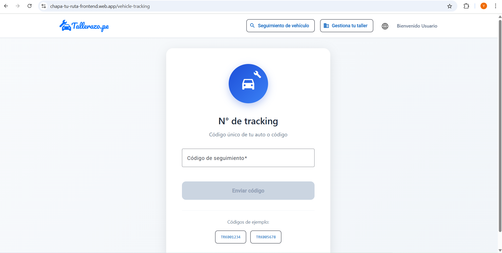

# Capítulo V: Product Implementation, Validation & Deployment

## 5.1. Software Configuration Management

### 5.1.1. Software Development Environment Configuration

En esta sección se proporcionan los enlaces a las aplicaciones y productos de software que utilizaremos durante el desarrollo del proyecto.

Con ese fin, se organizará en las siguientes secciones: 

* Project Management
* Requirements Management
* Product UX/UI Design
* Software Development
* Software Testing
* Software Documentation

Asimismo, se clasificarán los elementos de estas secciones como rutas de referencia (para software basado en modelos Saas) o rutas de descarga (para productos que se ejecuten en las computadoras de los miembros del equipo) para cada uno de los productos de software.

**Project Management**

Esta disciplina se fundamenta en la administración de proyectos y busca principalmente la mejora de procesos y su entorno con el propósito de lograr los resultados esperados.

* Durante el ciclo digital del proyecto, se llevará a cabo la implementación de un producto de software basado en el modelo SaaS, el cual funcionará a través de un navegador web; no obstante, no se desarrollará una versión de la aplicación móvil correspondiente.

**Requirements Management:**

Este proceso se enfoca en asegurar que una organización documente, verifique y satisfaga las necesidades y expectativas de sus clientes, así como las de las partes interesadas internas o externas.

* **Pivotal Tracker:** Esta herramienta se describe como una plataforma que facilita la gestión de las historias de usuario, organizándolas en epopeyas y evaluando su importancia en el programa según su puntuación. Se utilizó debido a su capacidad para permitir que cada miembro del equipo comparta una vista en tiempo real de los avances en cada proyecto, contribuyendo con diferentes secciones o ajustando el flujo del proyecto.

**Product UX/UI Design**

Esta herramienta facilita la creación digital de modelos que se integran en la vida del consumidor. En este caso, estamos desarrollando un modelo de sitio web compatible tanto con computadoras como con dispositivos móviles.

Para lograrlo, utilizamos varias herramientas de diseño y colaboración, que incluyen:

* **Uxpressia:** Uxpressia es una plataforma en línea especializada en el mapeo de la trayectoria del cliente. Nos ayuda a crear mapas de impacto y perfiles de usuario, como User Personas, Empathy Maps y Journey Maps. Puedes encontrar más información sobre Uxpressia en [este enlace](https://uxpressia.com/).
* **MIRO:** MIRO es una pizarra digital colaborativa en línea que se adapta a diversas actividades colaborativas, como investigación, ideación, creación de lluvias de ideas y mapas mentales. Es una herramienta versátil que facilita el trabajo en equipo. Descubre más sobre MIRO en [su sitio web](https://miro.com/app/dashboard/).
* **Figma:** Figma es una herramienta de prototipado web y un editor de gráficos vectoriales. A diferencia de otras herramientas, Figma se ejecuta en línea, lo que permite crear modelos que funcionan tanto en navegadores web como en navegadores móviles. Puedes explorar Figma en [este enlace](https://www.figma.com/design/).
* **Lucid Chart:** Esta es una aplicación de diagramación en línea que permite a los usuarios colaborar y trabajar juntos en tiempo real para crear una variedad de diseños, incluidos diagramas UML, mapas mentales, prototipos de software y otros tipos de diagramas. Puedes conocer más acerca de Lucid Chart en [este enlace](https://lucid.app/lucidchart/).
* **Overflow:** Overflow es una herramienta de diagramación que ofrece la posibilidad de colaborar en tiempo real. Utilizamos esta herramienta para crear diagramas de Userflows. Si deseas obtener más información sobre Overflow, visita [su sitio web](https://userflow.com/app/).

Estas herramientas nos ayudan a dar vida a nuestros diseños digitales y a garantizar que nuestros productos sean accesibles y atractivos en diferentes plataformas.

**Software Development:**

* **GitHub:** Esta es una plataforma digital donde se pueden alojar proyectos mediante repositorios, los cuales utilizan un sistema de control de versiones llamado Git. GitHub nos permite trabajar colaborativamente y tener un seguimiento detallado de los avances en el proyecto. Para acceder a nuestro repositorio utiliza [este enlace](https://github.com/Tulio-pe).

* **Git:** Este es un software de control de versiones el cual se instala localmente y nos permite tener un historial de cambios que se realizan en el proyecto mediante commits. También se utiliza para trabajar colaborativamente en repositorios que se encuentran subidos en GitHub. Para descargar Git utiliza [este enlace](https://git-scm.com).

**Software Testing:**

Se trata de la acción de evaluar los elementos y el funcionamiento del software sometido a prueba mediante procesos de validación y verificación.

**Lenguaje Gherkin:** Este lenguaje, conocido como DSL (Lenguaje Específico de Dominio), está diseñado específicamente para abordar problemas particulares. Además de poder ser interpretado en código, permite agregar historias de usuario del programa junto con sus componentes correspondientes, como Característica, Escenario, Ejemplo, Esquema de Escenario, Dado, Cuando, Entonces y Y.

**Software Documentation**

Se refiere a textos escritos o ilustraciones que acompañan al software de computadora o están integrados en su código fuente. Esta documentación tiene como objetivo explicar cómo funciona el software o cómo utilizarlo.


### 5.1.2. Source Code Management

En esta sección se detalla qué medios se utilizaron para el seguimiento de las modificaciones, así como la semántica y nomenclatura que se usará para los commits y releases que se implementarán durante el avance del proyecto.

Antes que nada, hay que mencionar que se utilizará GitHub como sistema de control de versiones del informe, landing page, web service y frontend de nuestro proyecto. Para ello se crearon sus respectivos repositorios:

* Url de la organización: [github.com/Tulio.pe](https://github.com/Tulio-pe)
* Repositorio Landing page: [github.com/Dotvue/Tulio.pe-landing-page](https://github.com/Tulio-pe/LandingTaller)

**GitFlow:**

Git Flow es un modelo de trabajo el cual consta de ramas principales y ramas de apoyo. Decidimos utilizar este modelo ya que nos permite mantener el código de nuestro proyecto limpio y ordenado al dividirlo en ramas, de tal forma que nos facilita trabajar colaborativamente. Además, lo que hace eficiente a GitFlow es que presenta una gran variedad de ramas, las cuales son:

* **Ramas Principales:**
    * **Main:** Esta es la rama principal desde donde se ramifican todas las demás. Además, contiene el código fuente que está listo para producción y cada cambio que se realice en esta se consideraría como una nueva versión del proyecto
    * **Develop:** Esta rama surge a partir de la rama Main y se utiliza para integrar las funcionalidades trabajadas en las ramas posteriores. Aquí se acopla todo el código que está listo para pasar a la rama Main y crear una nueva versión (Release) de nuestro proyecto.

* **Ramas de Apoyo:**

    * **Feature:** Estas son ramas creadas a partir Develop y se crean tantas como funcionalidades presenta nuestro proyecto. Una vez se termina de trabajar en estas ramas, deben fusionarse con la rama Develop para posteriormente ser eliminada. La nomenclatura que se utiliza es la siguiente:

            feature/benefits
            feature/profile
            feature/memberships

    * **Release:** Estas son ramas creadas a partir de Develop y sirven para preparar una nueva versión de nuestro proyecto que está listo para publicar. Cabe destacar que, en caso se requiera agregar nuevas funcionalidades, se tendrá que crear otra rama Release siguiendo las normas del Semantic Versioning 2.0.0, la cual se explicará más adelante.

    * **Hotfix:** Estas ramas son creadas a partir del Main y sirven para corregir rápidamente los errores que se presentan en el código publicado en esa rama (Main). Cabe destacar que una vez corregido el error, las ramas Hotfix deben fusionarse con las ramas Main y Develop.


**Semantic Versioning**

Este es un conjunto de reglas que nos permitirán gestionar correctamente la numeración de versiones de nuestro proyecto, para ello lo implementaremos en las ramas Release siguiendo el formato X.Y.Z (Major, Minor, Patch)

* **Versión de Parche (Z):** Se incrementa solo si se implementan correcciones compatibles con versiones anteriores.

* **Versión Secundaria (Y):** Se incrementa cuando se agregan nuevas funcionalidades que son compatibles con versiones anteriores.

* **Versión Principal (X):** Se incrementa cuando los cambios agregados no son compatibles con las versiones anteriores. Cabe destacar que al incrementar este parámetro, la enumeración de los parámetros Y y Z se inicializan en 0.

        release-1.0.5
        release-2.1.3
        release-2.2.1

**Conventional Commits**

Este es un conjunto de reglas, las cuales deben seguir nuestros commits para crear un historial explícito de los cambios realizados en el proyecto, haciéndolo más sencillo de comprender para el equipo de desarrollo. Los conventional commits siguen la siguiente estructura: 

    <type> [opcional scope]: <description>
    [optional body]
    [optional footer]

* **type:** Dependiendo del cambio que se realicen en el proyecto, los commits pueden ser:
    * **feat:** Cuando se agrega una nueva funcionalidad (feature)
    * **docs:** Cuando se realizan cambios en la documentación del proyecto
    * **fix:** Cuando se corrige un error en el código
    * **chore**: Cuando se realizan cambios que no afectan al código
    * **refactor:** Cuando se realizan cambios es la estructura del código, sin afectar al comportamiento del proyecto
    * **build**: Cuando se realizan cambios en los componentes del proyecto, como dependencias externas.
    * **perf:** Cuando se realizan cambio que mejoran el rendimiento del proyecto
* **scope:** Este es un campo opcional, que nos permite especificar el alcance que tiene el commit.
* **description:** Este es un campo obligatorio, ya que proporciona información breve y concisa de los cambios que se han realizado. Además debe ser escrito en minúsculas y de modo imperativo
* **body:** Este es un campo opcional en el cual se detalla más información sobre el commit, como el motivo del cambio. 
* **footer:** Este es un campo opcion y se utiliza para informar respecto a cambios importantes en el proyecto

### 5.1.3. Source Code Style Guide & Conventions

**Nomenclatura General**

Para los nombres de variables, objetos, elementos y funciones no se utilizarán mayúsculas en estos nombres, ya que, de acuerdo con W3Schools (sin fecha), puesto que la combinación entre mayúsculas y minúsculas puede dificultar la legibilidad del código.

Ejemplos de nomenclatura estándar, siguiendo las recomendaciones de Google (s.f.):

```
.gallery {}
.video {}
.login {}
```

**Sangría**

Al trabajar con HTML, CSS y/o JavaScript, se aplicará un espaciado de dos espacios antes de cada línea que se encuentre dentro de un bloque. Según W3Schools (sin fecha), no se recomienda el uso de la tecla "Tabulación". 

Ejemplo de nomenclatura estándar de la sangría HTML según W3Schools(s.f):
``` html
<!DOCTYPE html>
<html>
  <head>
    <title>Título</title>
  </head>
  <body>
    <h1>Encabezado</h1>
    <p>Párrafo.</p>
  </body>
</html>
```


Ejemplo de formato estándar de sangría en CSS según W3Schools (s.f):

``` CSS
html {
  background: #fff; /* Fondo blanco */
  color: #404;     /* Color de texto gris */
}
```

Ejemplo de nomenclatura estándar de la sangría en JavaScript según W3School (s.f.):

``` JavaScript
function toCelsius(fahrenheit) {
  return (5 / 9) * (fahrenheit - 32);
}
```

**HTML:**


HTML, acrónimo de HyperText Markup Language en inglés, es un lenguaje de marcado que se utiliza para definir la estructura de una página web. También incluye funcionalidades que permiten controlar el comportamiento de diferentes elementos del contenido de la página, como cambiar el tamaño del texto o aplicar formato cursiva, entre otros. En nuestro proyecto, emplearemos HTML5, y las pautas a seguir para utilizar este lenguaje de la siguiente manera:

* **Declare Document Type**
La declaración del tipo de documento debe realizarse en la primera línea del código. Según Google (s.f.), se prefiere la sintaxis de HTML5 para todos los documentos HTML. Para declararla, simplemente copia lo siguiente:

``` html
<!DOCTYPE html>
```

* **Blank**
Cada vez que comienza un nuevo bloque, lista o tabla de gran longitud, es recomendable dejar una línea en blanco después del elemento anterior para mejorar la legibilidad y la presentación del código, de acuerdo con las pautas de W3Schools (s.f.).
Ejemplo:

``` html
<body>

<h1>Famous Cities</h1>

<h2>Tokyo</h2>
<p>Tokyo is the capital of Japan, the center of the Greater Tokyo Area, and the most populous metropolitan area in the world.</p>

<h2>London</h2>
<p>London is the capital city of England. It is the most populous city in the United Kingdom.</p>

<h2>Paris</h2>
<p>Paris is the capital of France. The Paris area is one of the largest population centers in Europe.</p>

</body>
```

Esta práctica de dejar una línea en blanco mejora la estructura y legibilidad del código HTML.

* **Quote attribute Values**
Para los valores de los atributos, aunque no sea una caractística obligatoria,es común utilizar comillas dobles alrededor de ellos. Según W3Schools (s.f), esto hace el código más legible y es una práctica común entre los desarrolladores. 
Ejemplo:

``` html
<table class="striped">
```

Este enfoque de usar comillas dobles alrededor de los valores de los atributos es ampliamente aceptado y recomendado en la comunidad de desarrollo web.

* **Never Skip the \<title> Element**
El elemento `<title>` permite que las páginas aparezcan en la lista de resultados al realizar búsquedas en un navegador web. Además, este elemento es responsable de proporcionar el nombre de la página cuando se agrega a marcadores o favoritos.
Ejemplo:

``` html
<title>HTML Style Guide and Coding Conventions</title>
```

Este elemento es esencial para mejorar la identificación y accesibilidad de una página web.

* **HTML Line-Wrapping**
A pesar de que  no exista un límite de palabras por línea en un documento HTML, no se recomienda generar líneas de código excesivamente largas. Para la siguiente línea, se deben utilizar al menos cuatro espacios para distinguir elementos secundarios.
Ejemplo según Google (s.f):

``` html
<button mat-icon-button color='primary' class="menu-button"
(click)="openMenu()">
<mat-icon>menu</mat-icon>
</button>
```


**CSS:**

Conocido así por el acrónimo de su nombre en inglés, Cascading Style Sheets, es un lenguaje que se enfoca en definir y mejorar la presentación de un documento basado en HTML. Las pautas a seguir al utilizar CSS son:

* **Shorthand Properties**
Se debe declarar los campos de los elementos en la menor cantidad de líneas posible, según Google (s.f). esto mejora la eficiencia del código y lo hace más legible. Además, se debe evitar agregar unidades después del valor cero.

Ejemplo segpun Google (s.f):

``` css
border-top: 0;
font: 100%/1.6 palatino, georgia, serif;
padding: 0 1em 2em;
```

* **Declaration**
Es importante incluir un espacio entre el nombre del selector del elemento y la llave que inicia el bloque de CSS. Tambien es necesario incluir un espacio entre los dos puntos que siguen del nombre de una propiedad y su valor correspondiente. Como en la mayoría de lenguajes de programación, debe colocarse punto y coma al final de cada declaración en CSS, según Google (s.f), esta práctica contribuye a mantener la coherencia en el código.

Ejemplo según Google (s.f)

``` css
html {
  background: #fff;
  color: #404;
}
```

* **CSS quotation Marks**
No se deben utilizar comillas dobles (`"`) en el código CSS; en su lugar, se permiten y deben emplearse comillas simples (`'`) únicamente para selectores de atributos y valores de propiedades.
Ejemplo conforme a las pautas estándar de Google (sin fecha):

``` css
html {
  font-family: 'open sans', arial, sans-serif;
}
```

Este ejemplo demuestra el uso de comillas simples para encerrar el valor del atributo `font-family` en CSS, lo cual es una práctica común y aceptada.

**JavaScript**

JavaScript es un lenguaje de programación que permite especificar de manera precisa las acciones que debe realizar el navegador web, incluyendo el orden de ejecución de tareas y la frecuencia con la que se deben llevar a cabo. A continuación, se presentan las pautas para el uso de JavaScript en nuestro proyecto:

* **Spaces around operators**
Se debe colocar un espacio alrededor de cada operador matemático y tambien dcomas que se usen en el código JavaScript. 
Ejemplo estándar de W3Schools (s.f):

``` javascript
let x = y + z;
const myArray = ['Volvo', 'Saab', 'Fiat'];
```

El uso consistente de espacios alrededor de operadores y comas mejora la legibilidad del código JavaScript.

* **Simple Statement's End**
Como en el caso de muchos otros lenguajes de programación, se debe terminar una declaración con punto y coma.
Ejemplo estándar según W3Schools (s.f):

``` javascript
const cars = ['Volvo', 'Saab', 'Fiat'];

const person = {
  firstName: "John",
  lastName: "Doe",
  age: 50,
  eyeColor: "blue"
};
```

* **Beginning and End of Function**
Un bloque de función debe incluir una llave al final de la primera línea, de modo que el cierre de la función esté en la última línea, sin necesidad de un punto y coma. Esto mismo se aplica a las estructuras condicionales y los bucles. 
Ejemplo estándar según W3Schools (s.f):

``` javascript
function toCelsius(fahrenheit) {
  return (5 / 9) * (fahrenheit - 32);
}
```

* **Object Rules**
Para la creación de un objeto, al igual que en una función, se comienza con una llave al final de la primera línea, pero en este caso, la llave de cierre debe ir seguida de un punto y coma. Para definir las propiedades del objeto, coloque dos puntos y un espacio para indicar su valor. Si el valor es un string, se debe encerrar entre comillas dobles.
Ejemplo estándar según W3Schools (s.f):

``` javascript
const person = {
  firstName: "John",
  lastName: "Doe",
  age: 50,
  eyeColor: "blue"
};
```

**Gherkin:**

Gherkin es un Lenguaje Específico de Dominio (DSL) que se utiliza para resolver problemas específicos mediante la generación de casos de prueba que validan una característica en diversos escenarios. Gherkin incluye varios elementos, entre los cuales los más conocidos y utilizados son Feature, Scenario, Example, Given, When y Then. A continuación, se presentan las pautas que debemos seguir al utilizar Gherkin en nuestro código:

* **Discernible Given-When-Then Blocks**
Es importante aplicar sangría a los elementos que representan los pasos a seguir en un escenario. En el caso de "And", se debe aplicar una sangría adicional. Siguiendo la recomendación de Keiblinger (2021), este enfoque ayuda a identificar rápidamente las partes que componen un escenario. A continuación, se muestra un ejemplo:

``` gherkin
Scenario: Administrador accedde al catálogo de combis diarios
  Given que el administrador está autenticado en la plataforma de administración
  When el administrador navega a la sección de "Catálogo de combis"
    Then el sistema debería mostrar una lista de combis afiliadas
      And proporcionar opciones de filtrado y búsqueda para facilitar la selección
      And permitir al administrador ver los detalles de cada nombre, descripción y precio
```


* **Step with Tables**
Según Keiblinger (2021), cuando sea necesario introducir valores en partes del escenario, se debe emplear una tabla o crear un formulario que refleje esa parte del escenario. Antes de esta representación, se deben colocar dos puntos.
Ejemplo:

``` gherkin
Then se mostrará el mensaje:
  | Mensaje |
  | Se completaron los requisitos adecuadamente |
```

* **Reducing Noise**
Con el propósito de reducir la acumulación de líneas de código excesivas en un escenario, los valores predeterminados deben colocarse en pasos para campos que no están muy relacionados con el escenario. Los valores "estándar" que coloquemos deben ir entre comillas simples. Según Keiblinger (2021), esta operación reduce considerablemente el tamaño del código.
Ejemplo:

``` gherkin
When escribo claramente los requisitos 'dominio en C'
```

* **Scenarios Separator**
Para separar dos escenarios, se debe insertar un salto de línea y, según Keiblinger (2021), de ser posible, agregar una línea de comentario para facilitar la legibilidad de estos. De esta manera, se identifica rápidamente el inicio y el fin de un escenario. 
Ejemplo:

``` gherkin
Scenario: Administrador recibe notificación sobre estado del pedido
Given que el administrador está autenticado en la plataforma de administración
When el estado de un pedido cambia, por ejemplo, de "Pendiente" o "Habilitado"
  Then el sistema debería enviar una notificación al administrador sobre el cambio de estado de la combi
    And la notificación debería incluir detalles relevantes de la combi, número de pasajeros, estado actual, fecha y hora estimada de llegada

# --------------------------

Scenario: Otro escenario
Given que en otro contexto
When ocurre algo diferente
  Then se muestra otro resultado
```


### 5.1.4. Software Deployment Configuration

Dado que hemos mencionado anteriormente, la administración de nuestro código fuente se llevará a cabo mediante GitHub. Además, utilizaremos GitHub Pages para la publicación y despliegue de la página.

En cuanto al desarrollo del landing page, estamos utilizando el repositorio ubicado en el siguiente URL: https://github.com/orgs/Tulio-pe/repositories


Para desplegar la Landing Page de manera local descargamos el zip, o podemos clonar el repositorio con la herramienta git y el comando: 

    git clone + URL repository

La URL del repositorio se ubica en la siguiente sección de cada repositorio en GitHub:


## 5.2. Landing Page, Services & Applications Implementation

### 5.2.1. Sprint 1
En la etapa inicial de nuestro proyecto, decidimos llevar a cabo la implementación del diseño de nuestra Landing Page utilizando WebStorm como el entorno de desarrollo.

Repositorio Github: https://github.com/Tulio-pe/LandingTaller

#### 5.2.1.1. Sprint  1.

Para el primer sprint el equipo establecio que el desarrollo de las tareas serian unas 20 horas.

<table>
    <thead>
        <tr>
            <th>Sprint #</th>
            <th>Sprint 1</th>
        </tr>
    </thead>
    <tbody>
        <tr>
            <td colspan="2"><b>Sprint  Background</b></td>
        </tr>
        <tr>
            <td>Date</td>
            <td>2025/04/02</td>
        </tr>
        <tr>
            <td>Time</td>
            <td>10:30 PM</td>
        </tr>
        <tr>
            <td>Location</td>
            <td>Google meet</td>
        </tr>
        <tr>
            <td>Prepared by</td>
            <td>Yasser Rentería Palacios</td>
        </tr>
        <tr>
            <td>Atendees (to  meeting)</td>
            <td>
                <li>Renato Guillermo Calvo Yalan</li>
                <li>Jesús Iván Castillo Vidal</li>
                <li>Gianfranco Jared Durand Vega</li>
                <li>Raúl Adrian Medina Cruzado</li>
            </td>
        </tr>
        <tr>
            <td>Sprint 1 Retrospective Summary</td>
            <td>
                Acuerdo de la implementación de una primera versión del Landing Page  
            </td>
        </tr>
        <tr>
            <td colspan="2"><b>Sprint Goal & User Stories</b></td>
        </tr>
        <tr>
            <td>Sprint 1 Goal</td>
            <td style="text-align: justify">
                <p>
                Nuestro objetivo en este sprint es desarrollar la primera versión de la Landing Page de Tallerazo, enfocándonos en una estructura que sea visualmente atractiva y fácil de navegar. Utilizando HTML y CSS, crearemos una interfaz responsive que se adapte de manera óptima a dispositivos móviles y de escritorio.
                </p>
                <p>
                Creemos que esta Landing Page ofrecerá una introducción profesional y accesible a Tallerazo, mejorando la experiencia de usuario y estableciendo una base sólida para la intecon el sistema. El éxito de este sprint se confirmará cuando los usuarios puedan explorar la Landing Page de manera fluida en distintos dispositivos, logrando una primera impresión positiva y una navegación sencilla que los motive a explorar más sobre el sistema.
                </p>
            </td>
        </tr>
        <tr>
            <td>Sprint 1 Velocity</td>
            <td>
                8
            </td>
        </tr>
        <tr>
            <td>Sum of story points</td>
            <td>
                8
            </td>
        </tr>
    </tbody>
</table>

#### 5.2.1.2. Aspect Leaders and Collaborators.

| Team Member (Last Name, First Name)    | GitHub Username    | Estructura general de la landing page (L/C) | Diseño UI/UX de la landing page (L/C) | Programación de la landing page (L/C) | Redacción del informe técnico (L/C) | Formato y presentación del informe (L/C) | Organización del contenido del informe (L/C) | Recolección de información (L/C) | Corrección ortográfica y de estilo (L/C) | Implementación de formularios o secciones interactivas (L/C) | Validación final del proyecto (L/C) |
|----------------------------------------|--------------------|--------------------------------------------|---------------------------------------|--------------------------------------|------------------------------------|--------------------------------------------|----------------------------------------------|---------------------------------|-------------------------------------------|-------------------------------------------------------------|----------------------------------|
| Rentería Palacios, Yasser              | Mitawarmi2000      | L                                          | C                                     | C                                    |                                    |                                            | L                                            |                                 | C                                         | L                                                           |                                  |
| Valerio Garcia, Raúl Adrian        | Necxuz18      | C                                          | L                                     |                                      | L                                  |                                            |                                              | C                               | L                                         |                                                             | C                                |
| Castillo Vidal, Jesús Iván             | Jcdev04            |                                            | C                                     | L                                    | C                                  | L                                          | C                                            |                                 |                                           | C                                                           | L                                |
| Castro Sanchez, Renato Guillermo          | tenzzly  | C                                          |                                       | C                                    |                                    | C                                          | L                                            | L                               |                                           |                                                             | C                                |
| Rodríguez Villa, Gianfranco Jared                | Azucarita           |                                            |                                       |                                      | C                                  | C                                          |                                              | C                               | L                                         | C                                                           | L                                |


#### 5.2.1.3. Sprint Backlog 1

| User Story | Work-Item / Task | Title | Description | Estimation (Hours) | Assigned To |
|------------|------------------|-------|-------------|--------------------|-------------|
| US07 | T01 | Crear sección "Quiénes Somos" | Diseñar y estructurar una sección que explique la misión y visión de la plataforma en la landing. | 3 | Gianfranco Durand |
| US08 | T02 | Implementar Botón "Ver Más" | Crear un botón visible que redirija del Landing hacia la Aplicación Web Principal. | 2 | Renato Calvo |
| US09 | T03 | Crear Sección de Planes | Desarrollar la sección donde se muestran los diferentes planes o paquetes de servicios. | 4 | Yasser Rentería |
| US10 | T04 | Crear Sección de Beneficios | Estructurar una sección en la landing que destaque los beneficios de usar la plataforma. | 3 | Jesús Castillo |
| US11 | T05 | Crear Sección de Contacto | Implementar un formulario de contacto simple (Nombre, Email, Mensaje) en la landing page. | 4 | Raúl Medina |
| US12 | T06 | Crear Sección "Cómo Funciona" | Desarrollar una explicación paso a paso del servicio en la landing. | 3 | Gianfranco Durand |
| US13 | T07 | Implementar Sección de FAQ | Crear y estructurar una sección de Preguntas Frecuentes en la landing page. | 4 | Renato Calvo |
| US14 | T08 | Mejorar Responsividad de la Landing | Asegurar que la landing page sea responsive en dispositivos móviles y tabletas. | 5 | Yasser Rentería |
| US15 | T09 | Mejorar Estética de la Landing (Colores e Imágenes) | Ajustar los colores, tipografías e imágenes para hacer la landing más atractiva visualmente. | 3 | Jesús Castillo |
| US16 | T10 | Agregar Footer con Información Legal | Crear un footer que incluya enlaces a Términos y Condiciones, Política de Privacidad y redes sociales. | 2 | Raúl Medina |


#### 5.2.1.4. Development Evidence for Sprint Review

En esta sección se explica y presenta los avances en implementación con relación a los productos de la solución según el alcance del Sprint: Landing Page y Reporte. La sección inicia con una introducción que resume los principales avances en la implementación. A continuación se presenta la tabla que incluye, para cada repositorio, los commits relacionados con la implementación.

| Repository  | Branch | Commit Id | Commit Message | Commit Message Body | Committed |
|:-----------:|:------:|:---------:|:--------------:|:-------------------:|:---------:|
| LandngTaller | main  | 1bef650   | first commit   | Estructura inicial del proyecto: archivos `.html`, `.css` e imágenes. | 27/04/2025 |
| Project-Documentation       | Azucarita-patch-1  | 
857ecc3   | docs(chapter04): fix image | Corrección de la imagen en el capítulo 4. | 01/04/25 |
| Project-Documentation       | Chapter-II  | 
b0bbb04   | Update Chapter-II.md | Actualización menor del archivo chapter02 | 01/04/25 |
| Project-Documentation       | main  | 9c6b029   | docs(Content): added the project mask | Añadido contenido inicial de la máscara del proyecto. | 01/04/25 |
| Project-Documentation       | main  | 935eb16   | feat: add new assets files | Añadido nuevos archivos en la carpeta de assets. | 01/04/25 |
| Project-Documentation       | main  |  
9781326 | Initial commit | Commit inicial del repositorio Report. | 06/04/25 |

#### 5.2.1.5. Execution Evidence for Sprint Review

Después de finalizar el Sprint 1, hemos logrado implementar algunas de las secciones de nuestra Landing Page, aunque con algunos desperfectos en cuanto a diseño. A continuación, te invitamos a explorar nuestros avances a través de imágenes que muestran el resultado obtenido.

*Seccion de navegacion* : Nos ayudara a redirigirnos a secciones especificas de la lading page y Banner que contendra un boton (Call to Action) que te llevara a registrarte a nuestra aplicación.


*Funcionality*: Seccion donde los visitantes de la lading page podrán ver como es que funciona nuestra aplicacion y que les ofrece.


*Misión y Visión*: sección donde se encuentra nuestra misión y visión como empresa


*Calls*: sección donde se encuentra otro call to action


*footer*: contenido extra, como telefono,correo y redes para que puedan comunicarse con la empresa.


#### 5.2.1.6. Services Documentation Evidence for Sprint Review

En el primer sprint, hemos realizado el diseño, la programación y el despligue de la Landing Page que presentará nuesta apliación web "Tallerazo"

<table> 
  <tr>
    <td> <strong>End Point </strong></td>
    <td align="center"> <strong>Funciones</strong> </td>
  </tr>

  <tr>
    <td> https://github.com/Tulio-pe/LandingTaller </td>
    <td> Desplegar Landing Page de Tallerazo</td>
  </tr>
</table>

#### 5.2.1.7. Software Deployment Evidence for Sprint Review

Para el despliegue de nuestra Landing Page hemos utilizado GitHub Pages. Para hacer esto, hemos trabajado en un repositorio de GitHub donde divimos el trabajo en ramas. En la sección de configuración y Pages, seleccionamos la rama main para desplegar nuestra web. 

**Link de la landing page desplegada:** https://github.com/Tulio-pe/LandingTaller


### 5.2.2. Sprint 2
#### 5.2.2.1. Sprint Planning 2.

En esta siguiente etapa de proyecto, nuestra principal objetivo sera desarrollar el frontend mediante WebStorm aun como nuestro entorno de desarrollo

Repositorio Github: https://github.com/Tulio-pe/Tallerazo-Front

Para nuestro segundo sprint el equipo estableció que el desarrollos de nuestras tareas se realizarian en un aproximado de 26 horas

<table>
    <thead>
        <tr>
            <th>Sprint #</th>
            <th>Sprint 2</th>
        </tr>
    </thead>
    <tbody>
        <tr>
            <td colspan="2"><b>Sprint  Background</b></td>
        </tr>
        <tr>
            <td>Date</td>
            <td>2025/05/12</td>
        </tr>
        <tr>
            <td>Time</td>
            <td>09:30 PM</td>
        </tr>
        <tr>
            <td>Location</td>
            <td>Discord</td>
        </tr>
        <tr>
            <td>Prepared by</td>
            <td>Yasser Rentería Palacios</td>
        </tr>
        <tr>
            <td>Atendees (to  meeting)</td>
            <td>
                <li>Yasser Rentería Palacios</li>
                <li>Jesús Iván Castillo Vidal</li>
                <li>Renato Guillermo Calvo Yalan</li>
                <li>Raúl Adrian Medina Cruzado</li>
            </td>
        </tr>
        <tr>
            <td>Sprint 1 Review Summary</td>
            <td>
                Este es el segundo sprint a realizar por el equipo
            </td>
        </tr>
        <tr>
            <td>Sprint 2 Retrospective Summary</td>
            <td>
                Acuerdo de el desarrollo del frontend de nuestra pagina web
            </td>
        </tr>
        <tr>
            <td colspan="2"><b>Sprint Goal & User Stories</b></td>
        </tr>
        <tr>
            <td>Sprint 2 Goal</td>
            <td style="text-align: justify">
                <p>
Nuestro enfoque está en desarrollar el frontend de la plataforma Tallerazo, priorizando un diseño atractivo, simple y fácil de usar, e implementando vistas clave como login, creación de taller con servicios y horarios, consulta de talleres disponibles, visualización de servicios y seguimiento del vehículo en reparación. También abordaremos los puntos pendientes del sprint anterior.

Creemos que esto aportará una navegación fluida y una experiencia más clara e intuitiva para los usuarios finales, facilitando tanto la búsqueda de talleres como la gestión de servicios por parte de las empresas.

Esto se confirmará cuando los usuarios puedan interactuar con las nuevas vistas de manera eficiente, navegar sin fricciones y las empresas logren gestionar sus horarios de atención a través del sistema con éxito.
                </p>
            </td>
        </tr>
        <tr>
            <td>Sprint 2 Velocity</td>
            <td>
                30
            </td>
        </tr>
        <tr>
            <td>Sum of story points</td>
            <td>
                30
            </td>
        </tr>
    </tbody>
</table>

#### 5.2.2.2. Aspect Leaders and Collaborators.

| Team Member (Last Name, First Name)    | GitHub Username     | Crear cuenta (corporativa) | Inicio de sesión | Dashboard Tallers | Talleres | Servicio de Talleres | Sección de usuario | Tracking de auto |
|----------------------------------------|----------------------|--------------------------------------|------------------|------------------|--------------------------|-------------------------------|-----------------------------------|-------------------------|
| Rentería Palacios, Yasser              | Mitawarmi2000        |                                      |                  | C                 |                          | L                             |                                   |                         |
| Valerio Garcia, Renato         | tenzzly      | L                                    | L                |                  | C                         |                               |                                   |                         |
| Castillo Vidal, Jesús Iván             | Jcdev04              | C                                     |                  |                  |                          |                               | L                                 |                         |
| Castro Sanchez, Gianfranco           |  Azucarita   |                                      |                  |                 |                       |                               |                                  |                         |
| Rodríguez Villa, Raúl Adrian               | Necxuz18              |                                      |                  |                  |                          |                               |                                  |                         |

#### 5.2.2.3. Sprint Backlog 2.

| **User Story** |                                 |        | **Work-Item / Task**                 |                                                            |                        |                 |                                                    |   |
| -------------- | ------------------------------- | ------ | ------------------------------------ | ---------------------------------------------------------- | ---------------------- | --------------- | -------------------------------------------------- | - |
| **Id**         | **Title**                       | **Id** | **Title**                            | **Description**                                            | **Estimation (Hours)** | **Assigned To** | **Status (To-do / In-Process / To-Review / Done)** |   |
| US09           | Conocer al Equipo de Desarrollo | T01    | Crear sección “Acerca de Nosotros”   | Diseñar y desarrollar sección de presentación del equipo   | 4                      | Raúl Medina     | Done                                           |   |
| US04           | Evaluación de Talleres          | T02    | Sistema de calificación              | Calificación de 1 a 5 estrellas con comentarios            | 8                      | Yasser Rentería | Done                                               |   |
| US06           | Visualización en Tiempo Real    | T03    | Módulo de seguimiento en tiempo real | Mostrar estado del vehículo durante el servicio            | 10                     | Jesús Castillo  | Done                                              |   |
| US07           | Acceso Rápido desde Landing     | T04    | Botón “Empezar” en landing           | Redirige a la aplicación web desde la landing page         | 3                      | Renato Calvo    | Done                                            |   |
| US13           | Ver Detalles del Taller         | T05    | Mostrar detalles del taller          | Dirección, fotos, horarios y servicios del taller          | 6                      | Jesús Castillo  | Done                                                |   |
| US15           | Landing Page Responsiva         | T06    | Ajustar diseño responsivo            | Optimizar diseño para distintos tamaños de pantalla        | 5                      | Renato Calvo    | Done                                                |   |
| US16           | Publicación de Servicios        | T07    | Gestión de servicios de taller       | Taller publica o edita servicios ofrecidos                 | 7                      | Yasser Rentería | Done                                                 |   |
| US18           | Registro de Taller              | T08    | Formulario de registro               | Datos + documentación para crear cuenta                    | 6                      | Jesús Castillo  | Done                                              |   |
| US20           | Actualizar horario de atención  | T09    | Edición de horario en tiempo real    | El taller edita su horario actual en la app                | 4                      | Renato Calvo    | Done                                                 |   |
| US21           | Seguimiento de trabajos         | T10    | Registro y estado de servicio        | Taller indica tipo de servicio, vehículo y tiempo estimado | 7                      | Yasser Rentería | Done                                               |   |
| US23           | Tracking del auto               | T11    | Ver estado con código de tracking    | Usuario ingresa código y ve el estado de su auto           | 5                      | Jesús Castillo  |Done                                               |   |
| US24           | Redirección al dashboard        | T12    | Botón para ir al dashboard           | Desde login, lleva al dashboard de cliente                 | 3                      | Renato Calvo    | Done                                               |   |


#### 5.2.2.4. Development Evidence for Sprint Review.

## Avances de Implementación

En esta sección se explica y presenta los avances en implementación con relación a los productos de la solución según el alcance del Sprint: FrontEnd. La sección inicia con una introducción que resume los principales avances en la implementación. A continuación se presenta la tabla que incluye, para cada repositorio, los commits relacionados con la implementación.

| Repository       | Branch | Commit Id | Commit Message                               | Commit Message Body                                                                      | Committed   |
|:----------------:|:------:|:---------:|:---------------------------------------------:|:-----------------------------------------------------------------------------------------:|:-----------:|
| Tallerazo-Front   | develop   | 081f636   | feat: merge tracking feature          | Se fusionó la rama del tracking al develop para probar                     | 16/05/2025  |
| FTallerazo-Front   | feature/test  | d81f51f   | feat(dashboard):Added navegation bard and Cars and Dashboard       | Se añadió la interfaz del dashboard del taller                          | 16/05/2025  |
| Tallerazo-Front   | feature/tracking |04b6e56  | feat(coretrack): added vehicle tracking service.   | Implementación del seguimiento de los vehículos                                   | 14/04/2025  |
| Tallerazo-Front   | feature/auth |   |      |                    | 28/04/2025  |


#### 5.2.2.5. Execution Evidence for Sprint Review.

Durante el Sprint 2, el equipo centró sus esfuerzos en el desarrollo del frontend, priorizando la implementación visual y estructural. Debido a que se trató principalmente de trabajo de interfaz, no fue necesario realizar pruebas de testing en esta etapa.

#### 5.2.2.6. Execution Evidence for Sprint Review.

Tras finalizar el Sprint 2, hemos logrado implementar varias secciones del frontend. Aunque aún existen detalles por pulir en el diseño visual, ya es posible visualizar gran parte de la estructura y funcionalidad planteadas. A continuación, te mostramos capturas que reflejan los avances alcanzados hasta el momento.

*Seccion de registro e inicio de sesión* : Pantalla para que empresas accedan o se registren en la plataforma. Las empresas deben completar sus datos y subir el logo de su marca como parte del proceso de registro.


*Dashboard*: Página principal del el taller donde puede visualizar los autos en estado de reparación


*Autos*: Sección con lista de los autos con su número de placa y demás características


*Tracker*: donde puedes escribir el código de tracking del auto


*Tracking*: Permite visualizar el seguimiento de tu vehículo en tiempo real


#### 5.2.1.7. Software Deployment Evidence for Sprint Review.

Para el despliegue de nuestro Frontend hemos utilizado . Para hacer esto, hemos trabajado en un repositorio de GitHub donde divimos el trabajo en ramas. En la sección de configuración y Pages, seleccionamos la rama main para desplegar nuestra web. 

Link de del FrontEnd desplegado: 

https://tallerazo-front-three.vercel.app/

#### 5.2.1.8. Team Collaboration Insights during Sprint.

La meta de este sprint fue la implementación del FrontEnd de nuestra pagina web y correcciones del informe. Para llevar a cabo este objetivo, hicimos uso de diversas herramientas como GitHub, WebStorm, Angular, AngularMaterial y heroicons.


### 5.2.3. Sprint 3

#### 5.2.3.1. Sprint Planning 3.

Para nuestro segundo sprint el equipo estableció que el desarrollos de nuestras tareas se realizarian en un aproximado de 26 horas

<table>
    <thead>
        <tr>
            <th>Sprint #</th>
            <th>Sprint 3</th>
        </tr>
    </thead>
    <tbody>
        <tr>
            <td colspan="2"><b>Sprint  Background</b></td>
        </tr>
        <tr>
            <td>Date</td>
            <td>2025/06/01</td>
        </tr>
        <tr>
            <td>Time</td>
            <td>10:30 PM</td>
        </tr>
        <tr>
            <td>Location</td>
            <td>Discord</td>
        </tr>
        <tr>
            <td>Prepared by</td>
            <td>Renato Guillermo Calbo Yalan</td>
        </tr>
        <tr>
            <td>Atendees (to  meeting)</td>
            <td>
                <li>Yasser Rentería Palacios</li>
                <li>Jesús Iván Castillo Vidal</li>
                <li>Raúl Adrian Medina Cruzado</li>
            </td>
        </tr>
        <tr>
            <td>Sprint 2 Review Summary</td>
            <td>
                Este es el tercer sprint a realizar por el equipo
            </td>
        </tr>
        <tr>
            <td>Sprint 3 Retrospective Summary</td>
            <td>
                Acuerdo en desarrollar el backend a más de 40% de avance y mejorar el frontend
            </td>
        </tr>
        <tr>
            <td colspan="2"><b>Sprint Goal & User Stories</b></td>
        </tr>
        <tr>
            <td>Sprint 3 Goal</td>
            <td style="text-align: justify">
                <p>
                Nuestro enfoque está en consolidar el desarrollo del sistema Tallerazo, completando al menos el 40% de las funcionalidades del backend, optimizando el frontend con mejoras visuales y de experiencia de usuario, y estableciendo un pipeline de deployment funcional para ambos componentes.

Creemos que esto aportará mayor estabilidad, eficiencia de desarrollo y una experiencia de navegación más fluida y profesional para los usuarios de la plataforma.

Esto se confirmará cuando los usuarios puedan interactuar con una versión funcional del sistema con navegación estable, el equipo logre desplegar los cambios desde desarrollo hasta producción de forma automatizada, y se resuelvan satisfactoriamente las observaciones pendientes del sprint anterior y del sprint 2.
                </p>
            </td>
        </tr>
        <tr>
            <td>Sprint 3 Velocity</td>
            <td>
                30
            </td>
        </tr>
        <tr>
            <td>Sum of story points</td>
            <td>
                30
            </td>
        </tr>
    </tbody>
</table>

#### 5.2.3.2. Aspect Leaders and Collaborators.

| Team Member (Last Name, First Name) | GitHub Username | Gestión de Cuentas y Autenticación | Gestión de Información del Taller | Búsqueda y Visualización de Talleres | Gestión de Vehículos | Gestión de Órdenes de Reparación | Seguimiento de Reparaciones | Creación de Endpoints |
|--------------------------------------|-----------------|-------------------------------------|-----------------------------------|--------------------------------------|---------------------|-----------------------------------|----------------------------|---------------------|
| Rentería Palacios, Yasser | Mitawarmi2000 | C | L | | | | | C |
| Valerio García, Renato | tenzzly | L | | C | | | | L |
| Castillo Vidal, Jesús Iván | Jcdev04 | C | | | L | | | C |
| Medina Cruzado, Raúl Adrián | Necxuz18 | | | | | C | L | C |

#### 5.2.3.3. Sprint Backlog 3.
<table border="1">
  <caption>Sprint #3 </caption>
  <thead>
    <tr>
      <th colspan="2">Technical Story</th>
      <th colspan="6">Work-Item / Task</th>
    </tr>
    <tr>
      <th>Id</th>
      <th>Title</th>
      <th>Id</th>
      <th>Title</th>
      <th>Description</th>
      <th>Estimation (Hours)</th>
      <th>Assigned To</th>
      <th>Status (To-do / In-Process / To-Review / Done)</th>
    </tr>
  </thead>
  <tbody>
    <tr>
      <td>TS01</td>
      <td>Implementar Sistema de Autenticación Basado en JWT</td>
      <td>TS01</td>
      <td>Implementar Sistema de Autenticación Basado en JWT</td>
      <td>Se implementará la lógica de generación y validación de tokens JWT en el backend.</td>
      <td>20</td>
      <td>Raul</td>
      <td>Done</td>
    </tr>
    <tr>
      <td>TS02</td>
      <td>Implementar Hashing de Contraseñas con Bcrypt</td>
      <td>TS02</td>
      <td>Implementar Hashing de Contraseñas con Bcrypt</td>
      <td>Se integrará la librería Bcrypt para el hashing de contraseñas durante el registro y la verificación.</td>
      <td>8</td>
      <td>Renato</td>
      <td>Done</td>
    </tr>
    <tr>
      <td>TS03</td>
      <td>Configurar Gestión Segura de Variables de Entorno</td>
      <td>TS03</td>
      <td>Configurar Gestión Segura de Variables de Entorno</td>
      <td>Se configurará el cargado de variables de entorno desde archivos .env o gestores de secretos.</td>
      <td>12</td>
      <td>Jesus</td>
      <td>Done</td>
    </tr>
    <tr>
      <td>TS04</td>
      <td>Diseñar y Configurar la Base de Datos Relacional (MySQL)</td>
      <td>TS04</td>
      <td>Diseñar y Configurar la Base de Datos Relacional (MySQL)</td>
      <td>Se creará el esquema de la base de datos MySQL con tablas, relaciones e índices.</td>
      <td>30</td>
      <td>Yasser</td>
      <td>Done</td>
    </tr>
    <tr>
      <td>TS05</td>
      <td>Desarrollar API RESTful para la Gestión de Usuarios</td>
      <td>TS05</td>
      <td>Desarrollar API RESTful para la Gestión de Usuarios</td>
      <td>Se construirán los endpoints REST para operaciones CRUD de usuarios.</td>
      <td>25</td>
      <td>Raul</td>
      <td>Done</td>
    </tr>
    <tr>
      <td>TS06</td>
      <td>Desarrollar API RESTful para la Gestión de Talleres y Citas</td>
      <td>TS06</td>
      <td>Desarrollar API RESTful para la Gestión de Talleres y Citas</td>
      <td>Se crearán los endpoints REST para la búsqueda, creación y gestión de talleres y citas.</td>
      <td>35</td>
      <td>Renato</td>
      <td>Done</td>
    </tr>
    <tr>
      <td>TS07</td>
      <td>Implementar Sistema de Notificaciones en la Aplicación</td>
      <td>TS07</td>
      <td>Implementar Sistema de Notificaciones en la Aplicación</td>
      <td>Se desarrollará la funcionalidad para generar, almacenar y mostrar notificaciones.</td>
      <td>20</td>
      <td>Jesus</td>
      <td>Done</td>
    </tr>
    <tr>
      <td>TS08</td>
      <td>Implementar Paginación y Filtrado Avanzado en Listados</td>
      <td>TS08</td>
      <td>Implementar Paginación y Filtrado Avanzado en Listados</td>
      <td>Se añadirán parámetros de paginación y filtrado a los endpoints de listado de datos.</td>
      <td>15</td>
      <td>Yasser</td>
      <td>Done</td>
    </tr>
    <tr>
      <td>TS09</td>
      <td>Optimizar Consultas a la Base de Datos para Rendimiento</td>
      <td>TS09</td>
      <td>Optimizar Consultas a la Base de Datos para Rendimiento</td>
      <td>Se analizarán y refactorizarán consultas SQL y se aplicarán índices para mejorar la eficiencia.</td>
      <td>25</td>
      <td>Raul</td>
      <td>Done</td>
    </tr>
  </tbody>
</table>

#### 5.2.3.4. Development Evidence for Sprint Review.

## Avances de Implementación

En esta sección se explica y presenta los avances en implementación con relación a los productos de la solución según el alcance del Sprint: FrontEnd y Backend. La sección inicia con una introducción que resume los principales avances en la implementación. A continuación se presenta la tabla que incluye, para cada repositorio, los commits relacionados con la implementación.

| Repository       | Branch | Commit Id | Commit Message                               | Commit Message Body                                                                      | Committed   |
|:----------------:|:------:|:---------:|:---------------------------------------------:|:-----------------------------------------------------------------------------------------:|:-----------:|
| Landing Tallerazo   | develop   | 1412c44 | feat: add translation configuration for ngx-translate with HttpLoader   | Se añadió la configuración del Httploader                    | 16/06/2025  |
| FrontEnd   | feature/workshop-discovery  | cdbdd76  | feat(workshop-discovery): added workshop discovery files. | Se añadió los archivos correspondientes para mostrar los talleres  | 07/06/2025  |
| Backend   | feature/IAM |0714bc2 | fix: foraign keys   | Se arreglo la lógica para los foraign keys         | 22/06/2025  |


#### 5.2.3.5. Execution Evidence for Sprint Review.

Tras finalizar el Sprint 2, hemos logrado implementar varias secciones del frontend. Aunque aún existen detalles por pulir en el diseño visual, ya es posible visualizar gran parte de la estructura y funcionalidad planteadas. A continuación, te mostramos capturas que reflejan los avances alcanzados hasta el momento.

*Seccion de registro e inicio de sesión* : Pantalla para que empresas accedan o se registren en la plataforma. Las empresas deben completar sus datos.


*Dashboard* : Pantalla para que empresas accedan a los estados de reparación de los vehículos y a crear una reparación,


*Cars* : Pantalla para que empresas vean los autos que tienen en espera o dentro de la revisión.


*Configuration* : Pantalla para que empresas accedan a la configuración de sus datos para cambiarlos y cambiar sus horarios de atención.


*Workshops* : Pantalla para que los conductores vean los talleres mecánicos que están cerca a él y los servicios que ofrecen de manera resumida.


*Workshops Details* : Pantalla para que los conductores vean los talleres de manera detallada y puedan contactar con ellos.


*Code* : Pantalla para que los conductores cuando la empresa les de un código puedan ingresar su código de seguimiento.



*Vehícle Tracking* : Pantalla para que los conductores vean el seguimienot en tiempo real de los servicios le están haciendo a su auto.


#### 5.2.3.6.Services Documentation Evidence for Sprint Review.

*Endpoints* : Muestra de los endpints correctamente implementados en Swagger.


#### 5.2.3.7. Software Deployment Evidence for Sprint Review.


#### 5.2.3.8. Team Collaboration Insights during Sprint.

### 5.2.4 Sprint 4

<h4>5.2.4.1. Sprint Planning 4.</h4>

Para nuestro cuarto sprint, el equipo estableció que el desarrollo de nuestras tareas se realizaría en un aproximado de 162 horas.

<table>
    <thead>
        <tr>
            <th>Sprint #</th>
            <th>Sprint 4</th>
        </tr>
    </thead>
    <tbody>
        <tr>
            <td colspan="2"><b>Sprint Background</b></td>
        </tr>
        <tr>
            <td>Date</td>
            <td>2025/07/08</td>
        </tr>
        <tr>
            <td>Time</td>
            <td>10:30 PM</td>
        </tr>
        <tr>
            <td>Location</td>
            <td>Discord</td>
        </tr>
        <tr>
            <td>Prepared by</td>
            <td>Renato Guillermo Calbo Yalan</td>
        </tr>
        <tr>
            <td>Attendees (to meeting)</td>
            <td>
                <li>Yasser Rentería Palacios</li>
                <li>Jesús Iván Castillo Vidal</li>
                <li>Raúl Adrian Medina Cruzado</li>
                <li>Renato Valerio García</li>
            </td>
        </tr>
        <tr>
            <td>Sprint 4 Review Summary</td>
            <td>
                Este es el cuarto sprint a realizar por el equipo, centrado en la segunda mitad de las historias técnicas.
            </td>
        </tr>
        <tr>
            <td>Sprint 4 Retrospective Summary</td>
            <td>
                Acuerdo en refinar la persistencia, optimizaciones de base de datos y mejoras en el manejo de errores para una mayor robustez del sistema.
            </td>
        </tr>
        <tr>
            <td colspan="2"><b>Sprint Goal & Technical Stories</b></td>
        </tr>
        <tr>
            <td>Sprint 4 Goal</td>
            <td style="text-align: justify">
                <p>
                Nuestro objetivo para este Sprint 4 es fortalecer la arquitectura del backend mediante la implementación robusta de la persistencia de datos para entidades clave, la optimización intensiva de consultas a la base de datos para mejorar el rendimiento, la adición de validaciones de negocio críticas para asegurar la integridad de los datos, y la estandarización del manejo de excepciones para proporcionar respuestas de API consistentes. Esto asegurará la integridad y eficiencia del sistema, preparando la plataforma para futuras funcionalidades y una experiencia de usuario más confiable. Se confirmará cuando todas las operaciones de datos sean consistentes y persistentes, las consultas clave respondan rápidamente, la API maneje los errores de forma predecible, y las entidades clave incorporen la trazabilidad de auditoría.
                </p>
            </td>
        </tr>
        <tr>
            <td>Sprint 4 Velocity</td>
            <td>
                162
            </td>
        </tr>
        <tr>
            <td>Sum of story points</td>
            <td>
                162
            </td>
        </tr>
    </tbody>
</table>

#### 5.2.4.2. Aspect Leaders and Collaborators.

| Team Member (Last Name, First Name) | GitHub Username | Gestión de Cuentas y Autenticación | Gestión de Información del Taller | Búsqueda y Visualización de Talleres | Gestión de Vehículos | Gestión de Órdenes de Reparación | Seguimiento de Reparaciones | Creación de Endpoints |
|--------------------------------------|-----------------|-------------------------------------|-----------------------------------|--------------------------------------|---------------------|-----------------------------------|----------------------------|---------------------|
| Rentería Palacios, Yasser | Mitawarmi2000 | | L | | | | | C |
| Valerio García, Renato | tenzzly | | C | | L | C | | |
| Castillo Vidal, Jesús Iván | Jcdev04 | | | | | L | | L |
| Medina Cruzado, Raúl Adrián | Necxuz18 | | C | L | L | L | | |

#### 5.2.4.3. Sprint Backlog 4

<table border="1">
  <caption>Sprint #4 </caption>
  <thead>
    <tr>
      <th colspan="2">Technical Story</th>
      <th colspan="6">Work-Item / Task</th>
    </tr>
    <tr>
      <th>Id</th>
      <th>Title</th>
      <th>Id</th>
      <th>Title</th>
      <th>Description</th>
      <th>Estimation (Hours)</th>
      <th>Assigned To</th>
      <th>Status (To-do / In-Process / To-Review / Done)</th>
    </tr>
  </thead>
  <tbody>
    <tr>
      <td>TS10</td>
      <td>Implementar Persistencia para Agregados Car y RepairOrder</td>
      <td>TS10</td>
      <td>Implementar Persistencia para Agregados Car y RepairOrder</td>
      <td>Se desarrollarán los repositorios y la lógica de persistencia para las entidades Car y RepairOrder utilizando JPA.</td>
      <td>28</td>
      <td>Raul</td>
      <td>Done</td>
    </tr>
    <tr>
      <td>TS11</td>
      <td>Optimizar Rendimiento de Consultas de Vehículos y Reparaciones</td>
      <td>TS11</td>
      <td>Optimizar Rendimiento de Consultas de Vehículos y Reparaciones</td>
      <td>Se analizarán y refactorizarán las consultas de CarQueryServiceImpl y RepairQueryServiceImpl, añadiendo índices para mejorar el rendimiento.</td>
      <td>22</td>
      <td>Renato</td>
      <td>Done</td>
    </tr>
    <tr>
      <td>TS12</td>
      <td>Implementar Validaciones de Negocio para Comandos de Reparaciones</td>
      <td>TS12</td>
      <td>Implementar Validaciones de Negocio para Comandos de Reparaciones</td>
      <td>Se añadirán validaciones de negocio específicas a los comandos (AddRepairCommand, CreateCarCommand, etc.) antes de su ejecución.</td>
      <td>18</td>
      <td>Jesus</td>
      <td>Done</td>
    </tr>
    <tr>
      <td>TS13</td>
      <td>Implementar Persistencia para Agregados Workshop</td>
      <td>TS13</td>
      <td>Implementar Persistencia para Agregados Workshop</td>
      <td>Se desarrollarán los repositorios y la lógica de persistencia para Workshop y sus entidades relacionadas (District, Province, etc.) utilizando JPA.</td>
      <td>30</td>
      <td>Yasser</td>
      <td>Done</td>
    </tr>
    <tr>
      <td>TS14</td>
      <td>Optimizar Rendimiento de Consultas de Talleres y Datos Geográficos</td>
      <td>TS14</td>
      <td>Optimizar Rendimiento de Consultas de Talleres y Datos Geográficos</td>
      <td>Se analizarán y optimizarán las consultas de WorkshopQueryServiceImpl y datos geográficos, aplicando índices necesarios.</td>
      <td>24</td>
      <td>Raul</td>
      <td>Done</td>
    </tr>
    <tr>
      <td>TS15</td>
      <td>Implementar Validaciones de Negocio para Comandos de Talleres y Datos Geográficos</td>
      <td>TS15</td>
      <td>Implementar Validaciones de Negocio para Comandos de Talleres y Datos Geográficos</td>
      <td>Se añadirán validaciones de negocio específicas a los comandos de talleres y datos geográficos (CreateWorkshopCommand, CreateDistrictCommand, etc.).</td>
      <td>16</td>
      <td>Renato</td>
      <td>Done</td>
    </tr>
    <tr>
      <td>TS16</td>
      <td>Mejorar Manejo de Excepciones y Mapeo a Respuestas REST</td>
      <td>TS16</td>
      <td>Mejorar Manejo de Excepciones y Mapeo a Respuestas REST</td>
      <td>Se implementará un controlador de excepciones global para mapear excepciones a respuestas HTTP consistentes.</td>
      <td>14</td>
      <td>Jesus</td>
      <td>Done</td>
    </tr>
    <tr>
      <td>TS17</td>
      <td>Implementar Patrón de Diseño para AuditableAbstractAggregateRoot y AuditableModel</td>
      <td>TS17</td>
      <td>Implementar Patrón de Diseño para AuditableAbstractAggregateRoot y AuditableModel</td>
      <td>Se configurará la actualización automática de campos de auditoría (createdAt, updatedAt) en entidades del dominio.</td>
      <td>10</td>
      <td>Yasser</td>
      <td>Done</td>
    </tr>
  </tbody>
</table>

### 5.3. Validation Interviews.

#### 5.3.1. Diseño de Entrevistas.

## Datos del Usuario
- **Nombre:** _______________
- **Apellido:** _______________  
- **Tipo de usuario:** [ ] Dueño de Taller [ ] [ ] Conductor [ ] Otro

---

## 1. Landing Page
1. ¿Entiendes qué hace la aplicación? [ ] Sí [ ] No
2. ¿Te interesa probarla? [ ] Sí [ ] No
3. ¿Los colores te gustan? [ ] Sí [ ] No

## 2. Registro
4. ¿Fue fácil crear la cuenta? [ ] Sí [ ] No
5. ¿Fue fácil registrar tu empresa? [ ] Sí [ ] No

## 3. Aplicación
6. ¿Es fácil navegar? [ ] Sí [ ] No
7. ¿Entiendes cómo crear reparaciones? [ ] Sí [ ] No
8. ¿Entiendes cómo agregar tu empresa? [ ] Sí [ ] No
9. ¿Entiendes cómo puedes ver tu auto a través de un código? [ ] Sí [ ] No
10. ¿El diseño se ve limpio? [ ] Sí [ ] No

## 4. General
10. **Califica la app del 1 al 10:** ___/10
11. **¿Qué mejorarías?** _______________
12. **¿La recomendarías?** [ ] Sí [ ] No

---

#### 5.3.2. Registro de Entrevistas.

### Segmento objetivo: Taller mecánico 


*Timing:* 09:27 - 10:27

*Nombres:* Diego

*Apellidos:* Cisneros

*Edad:* 27

*Distrito:* Villa EL Salvador

https://upcedupe-my.sharepoint.com/:v:/g/personal/u202210938_upc_edu_pe/EcAkYCaI2qxPrHOu_7jqpDYBx874wSck232STXRzGY5xsg?e=xExsN1&nav=eyJyZWZlcnJhbEluZm8iOnsicmVmZXJyYWxBcHAiOiJTdHJlYW1XZWJBcHAiLCJyZWZlcnJhbFZpZXciOiJTaGFyZURpYWxvZy1MaW5rIiwicmVmZXJyYWxBcHBQbGF0Zm9ybSI6IldlYiIsInJlZmVycmFsTW9kZSI6InZpZXcifX0%3D


*Timing:* 07:49 - 09:04

*Nombres:* Andy 

*Apellidos:* Calvo Yalan

*Edad:* 29

*Distrito:* Chorrillos

https://upcedupe-my.sharepoint.com/:v:/g/personal/u202210938_upc_edu_pe/EcAkYCaI2qxPrHOu_7jqpDYBx874wSck232STXRzGY5xsg?e=xExsN1&nav=eyJyZWZlcnJhbEluZm8iOnsicmVmZXJyYWxBcHAiOiJTdHJlYW1XZWJBcHAiLCJyZWZlcnJhbFZpZXciOiJTaGFyZURpYWxvZy1MaW5rIiwicmVmZXJyYWxBcHBQbGF0Zm9ybSI6IldlYiIsInJlZmVycmFsTW9kZSI6InZpZXcifX0%3D


*Timing:* 00:00 - 01:43

*Nombres:* Luciano 

*Apellidos:* Paco

*Edad:* 25

*Distrito:* Villa EL Salvador

https://upcedupe-my.sharepoint.com/:v:/g/personal/u202210938_upc_edu_pe/EcAkYCaI2qxPrHOu_7jqpDYBx874wSck232STXRzGY5xsg?e=xExsN1&nav=eyJyZWZlcnJhbEluZm8iOnsicmVmZXJyYWxBcHAiOiJTdHJlYW1XZWJBcHAiLCJyZWZlcnJhbFZpZXciOiJTaGFyZURpYWxvZy1MaW5rIiwicmVmZXJyYWxBcHBQbGF0Zm9ybSI6IldlYiIsInJlZmVycmFsTW9kZSI6InZpZXcifX0%3D

#### 5.3.3. Evaluaciones según heurísticas

# UX Heuristics & Principles Evaluation  
**Usability – Inclusive Design – Information Architecture**

---

**CARRERA**: Ingeniería de Software  
**CURSO**: Desarrollo de Aplicaciones Open Source  
**SECCIÓN**: 4289 
**PROFESOR(ES)**: Efraín Bautista 
**AUDITOR(ES)**: Tulio  
**CLIENTE(S)**: Conductores y Talleres

---

## SITIO O APP A EVALUAR:
**Nombre de App**: Gestión de Talleres

---

## TAREAS A EVALUAR:

El alcance de esta evaluación incluye la revisión de la usabilidad de las siguientes tareas:

1. Registro de un usuario nuevo  
2. Búsqueda de talleres cercanos  
3. Revisión del estado del servicio de un vehículo  
4. Reserva de una cita en taller  
5. Cancelación de una cita  
6. Visualización del historial de servicios  
7. Agregar comentarios o calificaciones al taller  
8. Navegación entre landing, front y panel de usuario  
9. Etc.

**No están incluidas en esta versión de la evaluación las siguientes tareas:**

1. Administración interna de talleres  
2. Gestión de mecánicos y personal  
3. Estadísticas o dashboards internos  
4. Configuración de parámetros de sistema  
5. Etc.

---

## ESCALA DE SEVERIDAD:

| Nivel | Descripción |
|-------|-------------|
| 1 | Problema superficial: puede ser superado fácilmente por el usuario o ocurre muy poco frecuentemente. |
| 2 | Problema menor: puede dificultar al usuario ocasionalmente. Se debería arreglar con baja prioridad. |
| 3 | Problema mayor: impide el uso normal a varios usuarios. Debe corregirse pronto. |
| 4 | Problema muy grave: bloquea el uso de la app. Debe corregirse antes del lanzamiento. |

---

## TABLA RESUMEN:

| #  | Problema | Escala de severidad | Heurística/Principio violado(a) |
|----|----------|----------------------|----------------------------------|
| 1  | No hay un botón para regresar al mapa de talleres desde el detalle del estado del servicio | 3 | Usability: Libertad y control del usuario |
| 2  | Los íconos del estado del vehículo no tienen explicación contextual | 2 | Usability: Reconocimiento antes que recuerdo |
| 3  | Imágenes de los talleres sin texto alternativo ("alt") | 3 | Inclusive Design: Proporciona experiencias comparables |
| 4  | Botón “Reagendar” visible aún si no hay cita activa | 2 | Usability: Visibilidad del estado del sistema |
| 5  | No hay información clara sobre los horarios de atención del taller | 2 | Information Architecture: Is it findable? |
| 6  | Landing page no tiene una opción directa de ir al panel de usuario | 1 | Usability: Flexibilidad y eficiencia de uso |
| 7  | No hay confirmación visual clara tras enviar un comentario o calificación | 2 | Usability: Feedback inmediato |

---

## DESCRIPCIÓN DE PROBLEMAS:

---

### PROBLEMA #1  
**No hay un botón para regresar al mapa de talleres desde el detalle del estado del servicio**  
**Severidad**: 3  
**Heurística violada**: Usabilidad - Libertad y control del usuario  

**Problema:**  
El usuario al consultar el estado de su vehículo entra a una vista detallada del servicio, pero no tiene una opción clara y visible para regresar al mapa general de talleres. Esto le obliga a usar el botón del navegador, afectando la fluidez de navegación.

**Recomendación:**  
Agregar un botón de “Regresar al mapa” fijo en la parte superior o inferior de la vista de detalle.

---

### PROBLEMA #2  
**Los íconos del estado del vehículo no tienen explicación contextual**  
**Severidad**: 2  
**Heurística violada**: Usabilidad - Reconocimiento antes que recuerdo  

**Problema:**  
Los íconos (ej. engranaje, reloj, check) no tienen etiquetas ni descripciones emergentes (tooltips), lo cual genera incertidumbre sobre el significado de cada uno.

**Recomendación:**  
Agregar tooltips o leyenda explicativa al pasar el cursor o tocar el ícono.

---

### PROBLEMA #3  
**Imágenes de los talleres sin texto alternativo (“alt”)**  
**Severidad**: 3  
**Heurística violada**: Inclusive Design - Proporciona experiencias comparables  

**Problema:**  
Usuarios con lectores de pantalla no pueden acceder al contenido visual de los talleres, lo cual limita la accesibilidad.

**Recomendación:**  
Agregar atributos `alt` descriptivos en todas las imágenes de los talleres.


## 5.3. Video About-the-Product.  

https://upcedupe-my.sharepoint.com/:v:/g/personal/u202214130_upc_edu_pe/Ec9nt-pv8JFKtiMH4UtseVcB74l5o4CGHIVxA7oC3Q1-hg?e=kRh0GL&nav=eyJyZWZlcnJhbEluZm8iOnsicmVmZXJyYWxBcHAiOiJTdHJlYW1XZWJBcHAiLCJyZWZlcnJhbFZpZXciOiJTaGFyZURpYWxvZy1MaW5rIiwicmVmZXJyYWxBcHBQbGF0Zm9ybSI6IldlYiIsInJlZmVycmFsTW9kZSI6InZpZXcifX0%3D

https://youtu.be/tybXEHvaWC0

## 5.3. Video About-the-Team. 

https://upcedupe-my.sharepoint.com/:v:/g/personal/u202214130_upc_edu_pe/EfS0W1SMu01JgYRP6fnLsCMBYI9Chmgfvl8Dw29MbzCQ3Q?e=pyF9YJ&nav=eyJyZWZlcnJhbEluZm8iOnsicmVmZXJyYWxBcHAiOiJTdHJlYW1XZWJBcHAiLCJyZWZlcnJhbFZpZXciOiJTaGFyZURpYWxvZy1MaW5rIiwicmVmZXJyYWxBcHBQbGF0Zm9ybSI6IldlYiIsInJlZmVycmFsTW9kZSI6InZpZXcifX0%3D

https://youtu.be/d5alZRwrCuo

## Bibliografía

Jansen, S. M. (2019). *Practical Domain-Driven Design in Enterprise Java: Using Jakarta EE, NoSQL Databases, and 
Microservices. Apress.* Retrieved from https://bit.ly/4flQyB7

Labedian, I. (2024, May 14). *How to deploy a .NET app on Railway using Docker*. I. Labedian. Retrieved from https://iliabedian.com/blog/deploy-dotnet-app-on-railway-with-docker  

Microsoft. (n.d.). *What is ASP.NET Core?.* Microsoft. Retrieved from https://dotnet.microsoft.com/es-es/learn/aspnet/what-is-aspnet-core

Miles, R., & Hamilton, K. (2006). Learning UML 2.0. O'Reilly Media. Retrieved from https://bit.ly/4fmPE7k

Netlify. (n.d.). *Deploying Vite on Netlify*. Netlify Docs. Retrieved from https://docs.netlify.com/frameworks/vite/

PrimeVue. (n.d.). *Setting up PrimeVue*. PrimeVue. Retrieved from https://primevue.org/setup/

SAP. (n.d.). *CRM: Customer relationship management solutions*. SAP. Retrieved from https://www.sap.com/latinamerica/products/crm.html

Shavin, M. (2020). *Learning Vue: A hands-on guide to building modern web applications with Vue.js.* Packt Publishing.

Siemens. (n.d.). *Siemens in Peru*. Siemens. Retrieved November 13, 2024, from https://www.siemens.com/pe/es.html

Structurizr. (n.d.). *Structurizr: Software architecture diagram design*. Structurizr. Retrieved from https://structurizr.com/

Vernon, V. (2013). *Implementing domain-driven design.* Addison-Wesley.

## Anexos

### Anexo A. Products Deployed.

Landing Page Desplegada: https://tallerazo-landingpage.web.app/
Frontend desplegado: https://chapa-tu-ruta-frontend.web.app/
Backend desplegado:

### Anexo B. Web tools

Figma Landing Page: https://www.figma.com/design/ps7LWFTeW8zE6Fk5hI4sHB/Untitled?node-id=5-56&p=f&t=qXMWw6NcQLEKtOAh-0

Web Applications User Flow Diagrams: https://www.figma.com/design/ps7LWFTeW8zE6Fk5hI4sHB/Untitled?node-id=5-56&p=f&t=qXMWw6NcQLEKtOAh-0

Web Applications Mock-ups: https://www.figma.com/design/ps7LWFTeW8zE6Fk5hI4sHB/Untitled?node-id=5-56&p=f&t=qXMWw6NcQLEKtOAh-0

Web Application Prototyting: https://www.figma.com/design/ps7LWFTeW8zE6Fk5hI4sHB/Untitled?node-id=5-56&p=f&t=qXMWw6NcQLEKtOAh-0

### Anexo C. Github Repositories

Link de la Organización Tulio: https://github.com/Tulio-pe

| Repositorios                  | Enlace al Respositorio                                  |
|-------------------------------|---------------------------------------------------------|
| TULIO Project Report     | https://github.com/Tulio-pe/Project-Documentation |
| TULIO Landing Page       | https://github.com/Tulio-pe/Landing-Tallerazo |
| TULIO Frontend       | https://github.com/Tulio-pe/FrontEnd  | 
| TULIO Backend       | https://github.com/Tulio-pe/Backend  | 
