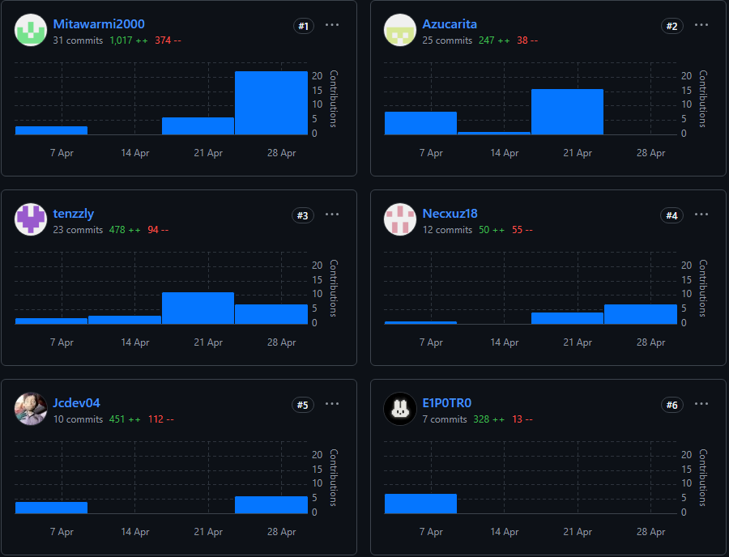

# 
COURSE PROJECT

    <strong>Universidad Peruana de Ciencias Aplicadas</strong> 
    </img> 
    <strong>Ingeniería de Software</strong> 
    <strong>Desarrollo de Aplicaciones Open Source</strong> 
    <strong>NRC: 4289</strong> 
    <strong>Profesor: Efraín Ricardo Bautista Ubillús </strong> 
     INFORME TRABAJO FINAL

#### Startup: **Tulio**
#### Product: **Tallerazo**

### 
Team  Members:

| Member                        | Code       |
|-------------------------------|------------|
| Yasser Rentería Palacios      | U202214130 |
| Renato Guillermo Calvo Yalan        | U202217053 |
| Gianfranco Jared Durand Vega | u202312614 |
| Raúl Adrian Medina Cruzado  | U202210938 |
| Jesús Iván Castillo Vidal     | U202322952 |

  Julio 2025 

  

# Registro de Versiones del Informe  

| Version | Fecha      | Autor                           | Descripción de Modificación                                                    |
|---------|------------|---------------------------------|--------------------------------------------------------------------------------|
| 0.0.1   | 08/04/2025 | All | Desarrollo Capítulo (1)                               |
| 0.0.2   | 22/04/2025 | All | Desarrollo Capítulo (2)                            |
| 0.0.3   | 22/04/2025 | Yasser, Renato | Desarrollo Capítulo (3)                       |
| 0.0.4   | 25/04/2025| All    | Desarrollo Capítulo (4)  |
| 0.0.5   | 26/04/2025 | Yasser              | Desarrollo Capítulo (5)                             | 

# Project Report Collaboration Insights  
Analiza cómo la colaboración y la gestión de tareas influyeron en los resultados del proyecto, destacando fortalezas y áreas de mejora para optimizar futuras estrategias.

Reporte: https://github.com/Tulio-pe/Project-Documentation

Organización: https://github.com/orgs/Tulio-pe/repositories

Landing Page: https://tulio-pe.github.io/LandingTaller/

TB1: El equipo entero participó en el desarrollo del sistema, asignando las tareas de manera equitativa entre todos. También trabajamos juntos en aspectos esenciales, como las entrevistas con usuarios y el diseño de la página de inicio. Este método integral y colaborativo nos permitió asegurar calidad y eficiencia durante todas las fases del proyecto.  

* Cada miembro redactó y organizó sus contenidos en formato Markdown, haciendo commits para garantizar el progreso en el repositorio.
* Se crearon los artefactos necesarios usando las herramientas recomendadas y se obtuvieron enlaces de imagen desde la carpeta "src" en la rama main del repositorio del informe.
* Se programaron reuniones para coordinar el avance de los elementos del informe y comunicar los logros del Sprint 1, centrado en la página de inicio.  

# Student Outcome
El curso contribuye al cumplimiento del **Student Outcome ABET – EAC - Student Outcome 3** Criterio: Capacidad de comunicarse efectivamente con una gama de audiencias.

## Student Outcome – TB1, Trabajo Parcial (TP) y TB2

El curso contribuye al cumplimiento del **Student Outcome ABET 3**, que evalúa la: **Capacidad de comunicarse efectivamente con una gama de audiencias.**

| Criterio | Acciones Realizadas | Conclusión |
|----------|---------------------|------------|
| **3.c1. Comunica oralmente con efectividad a diferentes rangos de audiencia** | **Yasser Rentería Palacios** **TB1:** Coordinó reuniones efectivas, adaptando el lenguaje técnico y organizacional según la audiencia. **TP:** Detalló el funcionamiento del buscador de seguimiento de vehículos y su integración con el dashboard de usuario.<br* **TB2:** Hizo las valadaciones respectivas con sus compañeros para el frotnend.  **Renato Guillermo Calvo Yalan** **TB1:** Explicó propuestas técnicas de forma clara durante presentaciones internas. **TP:** Comunicó con precisión los avances en el dashboard del taller y la gestión de horarios.  **TB2:** Comunicó de forma eficaz las validaciones de los endpoints creados.  **Raúl Adrian Medina Cruzado** **TB1:** Participó activamente en entrevistas con usuarios, adaptando su comunicación a un lenguaje accesible. **TP:** Expuso el funcionamiento del dashboard de usuario y la visualización de talleres.  **TB2:** Coordino las entrevistas de validación para las heurísticas.  **Gianfranco Jared Durand Vega** **TB1:** Presentó la arquitectura del backend con claridad, enfocándose en los objetivos del equipo. **TP:** Explicó las configuraciones del perfil y horarios del taller, adaptando el lenguaje técnico al equipo.  **Jesús Iván Castillo Vidal** **TB1:** Facilitó la retroalimentación continua, promoviendo la escucha activa y la conciliación de ideas. **TP:** Explicó de forma clara las funcionalidades del inicio de sesión, registro e ingreso de información del taller. **TB2:** Coordinó las participaciones en las audiencias de discord.  | **TB1:** El equipo demostró una comunicación oral efectiva, adaptando su lenguaje y medios según la audiencia. Esto permitió validar ideas, alinear criterios técnicos y funcionales, y asegurar la comprensión del sistema en las primeras fases del proyecto.  **TP:** Durante el desarrollo del frontend, la comunicación oral fue clave para coordinar tareas, presentar avances y resolver  **TB2:** Durante el desarrollo del frontend y backedn se hizo un mejora en la comunicación en las tareas realizadas cada uno  |
| **3.c2. Comunica por escrito con efectividad a diferentes rangos de audiencia** | **Yasser Rentería Palacios** **TB1:** Redactó documentación técnica clara y estructurada. **TP:** Documentó el buscador y dashboard de seguimiento con lenguaje accesible.  **TB2:** Documentó parte del backend para revisar las lógicas de algunas clases  **Renato Guillermo Calvo Yalan** **TB1:** Elaboró contenido UX en formato Markdown. **TP:** Documentó el dashboard del taller y la gestión de horarios.  **TB2:** Redactó la configuración de los endpoints respectivos  **Raúl Adrian Medina Cruzado** **TB1:** Organizó y revisó entregables escritos. **TP:** Redactó descripciones del dashboard de usuario y visualización de talleres.  **TB2:** Documentó las entrevistas de validación de forma correcta   **Gianfranco Jared Durand Vega** **TB1:** Documentó decisiones de arquitectura con precisión. **TP:** Redactó la configuración del perfil y horarios del taller.  **Jesús Iván Castillo Vidal** **TB1:** Supervisó la calidad del informe final y la landing page. **TP:** Documentó el inicio de sesión, registro e ingreso de información del taller. **TB2:** Constante revisión de los escritos en los comentarios del frontend.  | **TB1:** La documentación escrita fue clara, coherente y adaptada al público objetivo, facilitando la comprensión del sistema por parte de usuarios, docentes y evaluadores.  **TP:** En el trabajo parcial, se reforzó la calidad de la documentación técnica y funcional, lo que permitió una mejor presentación del sistema y una comunicación efectiva de las mejoras implementadas en el frontend.  **TB2:** Se mejoró los comentarios de los productos del backend y frontend para evidenciar la lógica de y flujo de la aplicación   |

## Table of Contents

- [Registro de Versiones del Informe](#registro-de-versiones-del-informe)
- [Project Report Collaboration Insights](#project-report-collaboration-insights)
- [Student Outcome](#student-outcome)

- [Capítulo I: Introducción](Chapter-I.md#capítulo-i-introducción)
  - [1.1. Startup Profile](Chapter-I.md#11-startup-profile)
    - [1.1.1. Descripción de la Startup](Chapter-I.md#111-descripción-de-la-startup)
    - [1.1.2. Perfiles de integrantes del equipo](Chapter-I.md#112-perfiles-de-integrantes-del-equipo)
  - [1.2. Solution Profile](Chapter-I.md#12-solution-profile)
    - [1.2.1. Antecedentes y problemática](Chapter-I.md#121-antecedentes-y-problemática)
    - [1.2.2. Lean UX Process](Chapter-I.md#122-lean-ux-process)
      - [1.2.2.1. Lean UX Problem Statements](Chapter-I.md#1221-lean-ux-problem-statements)
      - [1.2.2.2. Lean UX Assumptions](Chapter-I.md#1222-lean-ux-assumptions)
      - [1.2.2.3. Lean UX Hypothesis Statements](Chapter-I.md#1223-lean-ux-hypothesis-statements)
      - [1.2.2.4. Lean UX Canvas](Chapter-I.md#1224-lean-ux-canvas)
  - [1.3. Segmentos objetivo](Chapter-I.md#13-segmentos-objetivo)

- [Capítulo II: Requirements Elicitation & Analysis](Chapter-II.md#capítulo-ii-requirements-elicitation-analysis)
  - [2.1. Competidores](Chapter-II.md#21-competidores)
    - [2.1.1. Análisis competitivo](Chapter-II.md#211-análisis-competitivo)
    - [2.1.2. Estrategias y tácticas frente a competidores](Chapter-II.md#212-estrategias-y-tácticas-frente-a-competidores)
  - [2.2. Entrevistas](Chapter-II.md#22-entrevistas)
    - [2.2.1. Diseño de entrevistas](Chapter-II.md#221-diseño-de-entrevistas)
    - [2.2.2. Registro de entrevistas](Chapter-II.md#222-registro-de-entrevistas)
    - [2.2.3. Análisis de entrevistas](Chapter-II.md#223-análisis-de-entrevistas)
  - [2.3. Needfinding](Chapter-II.md#23-needfinding)
    - [2.3.1. User Personas](Chapter-II.md#231-user-personas)
    - [2.3.2. User Task Matrix](Chapter-II.md#232-user-task-matrix)
    - [2.3.3. User Journey Mapping](Chapter-II.md#233-user-journey-mapping)
    - [2.3.4. Empathy Mapping](Chapter-II.md#234-empathy-mapping)
    - [2.3.5. As-is Scenario Mapping](Chapter-II.md#235-as-is-scenario-mapping)
  - [2.4. Ubiquitous Language](Chapter-II.md#24-ubiquitous-language)

- [Capítulo III: Requirements Specification](Chapter-III.md#capítulo-iii-requirements-specification)
  - [3.1. To-Be Scenario Mapping](Chapter-III.md#31-to-be-scenario-mapping)
  - [3.2. User Stories](Chapter-III.md#32-user-stories)
  - [3.3. Impact Mapping](Chapter-III.md#33-impact-mapping)
  - [3.4. Product Backlog](Chapter-III.md#34-product-backlog)

- [Capítulo IV: Product Design](Chapter-IV.md#capítulo-iv-product-design)
  - [4.1. Style Guidelines](Chapter-IV.md#41-style-guidelines)
    - [4.1.1. General Style Guidelines](Chapter-IV.md#411-general-style-guidelines)
    - [4.1.2. Web Style Guidelines](Chapter-IV.md#412-web-style-guidelines)
  - [4.2. Information Architecture](Chapter-IV.md#42-information-architecture)
    - [4.2.1. Organization Systems](Chapter-IV.md#421-organization-systems)
    - [4.2.2. Labeling Systems](Chapter-IV.md#422-labeling-systems)
    - [4.2.3. SEO Tags and Meta Tags](Chapter-IV.md#423-seo-tags-and-meta-tags)
    - [4.2.4. Searching Systems](Chapter-IV.md#424-searching-systems)
    - [4.2.5. Navigation Systems](Chapter-IV.md#425-navigation-systems)
  - [4.3. Landing Page UI Design](Chapter-IV.md#43-landing-page-ui-design)
    - [4.3.1. Landing Page Wireframe](Chapter-IV.md#431-landing-page-wireframe)
    - [4.3.2. Landing Page Mock-up](Chapter-IV.md#432-landing-page-mock-up)
  - [4.4. Web Applications UX/UI Design](Chapter-IV.md#44-web-applications-uxui-design)
    - [4.4.1. Web Applications Wireframes](Chapter-IV.md#441-web-applications-wireframes)
    - [4.4.2. Web Applications Wireflow Diagrams](Chapter-IV.md#442-web-applications-wireflow-diagrams)
    - [4.4.3. Web Applications Mock-ups](Chapter-IV.md#443-web-applications-mock-ups)
    - [4.4.4. Web Applications User Flow Diagrams](Chapter-IV.md#444-web-applications-user-flow-diagrams)
  - [4.5. Web Applications Prototyping](Chapter-IV.md#45-web-applications-prototyping)
  - [4.6. Domain-Driven Software Architecture](Chapter-IV.md#46-domain-driven-software-architecture)
    - [4.6.1. Software Architecture Context Diagram](Chapter-IV.md#461-software-architecture-context-diagram)
    - [4.6.2. Software Architecture Container Diagrams](Chapter-IV.md#462-software-architecture-container-diagrams)
    - [4.6.3. Software Architecture Components Diagrams](Chapter-IV.md#463-software-architecture-components-diagrams)
  - [4.7. Software Object-Oriented Design](Chapter-IV.md#47-software-object-oriented-design)
    - [4.7.1. Class Diagrams](Chapter-IV.md#471-class-diagrams)
    - [4.7.2. Class Dictionary](Chapter-IV.md#472-class-dictionary)
  - [4.8. Database Design](Chapter-IV.md#48-database-design)
    - [4.8.1. Database Diagram](Chapter-IV.md#481-database-diagram)

- [Capítulo V: Product Implementation, Validation & Deployment](Chapter-V.md#capítulo-v-product-implementation-validation-deployment)
  - [5.1. Software Configuration Management](Chapter-V.md#51-software-configuration-management)
    - [5.1.1. Software Development Environment Configuration](Chapter-V.md#511-software-development-environment-configuration)
    - [5.1.2. Source Code Management](Chapter-V.md#512-source-code-management)
    - [5.1.3. Source Code Style Guide & Conventions](Chapter-V.md#513-source-code-style-guide--conventions)
    - [5.1.4. Software Deployment Configuration](Chapter-V.md#514-software-deployment-configuration)
  - [5.2. Landing Page, Services & Applications Implementation](Chapter-V.md#52-landing-page-services--applications-implementation)
    - [5.2.1. Sprint 1](Chapter-V.md#52x-sprint-1)
      - [5.2.1.1. Sprint Planning 1](Chapter-V.md#52x1-sprint-planning-1)
      - [5.2.1.2. Aspect Leaders and Collaborators](Chapter-V.md#52x2-aspect-leaders-and-collaborators)
      - [5.2.1.3. Sprint Backlog 1](Chapter-V.md#52x3-sprint-backlog-1)
      - [5.2.1.4. Development Evidence for Sprint Review](Chapter-V.md#52x4-development-evidence-for-sprint-review)
      - [5.2.1.5. Execution Evidence for Sprint Review](Chapter-V.md#52x5-execution-evidence-for-sprint-review)
      - [5.2.1.6. Services Documentation Evidence for Sprint Review](Chapter-V.md#52x6-services-documentation-evidence-for-sprint-review)
      - [5.2.1.7. Software Deployment Evidence for Sprint Review](Chapter-V.md#52x7-software-deployment-evidence-for-sprint-review)
      - [5.2.1.8. Team Collaboration Insights during Sprint](Chapter-V.md#52x8-team-collaboration-insights-during-sprint)

- [Conclusiones](#conclusiones)
- [Bibliografía](#bibliografia) 
- [Anexos](#anexos)
